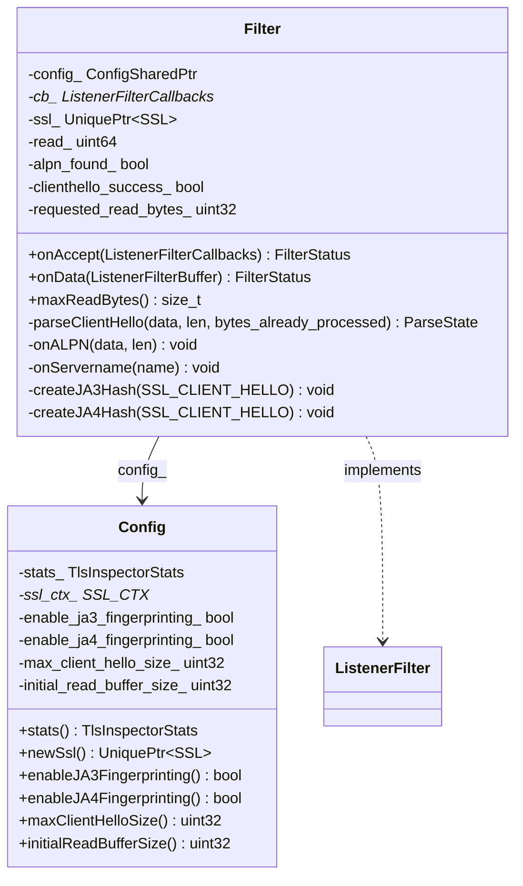
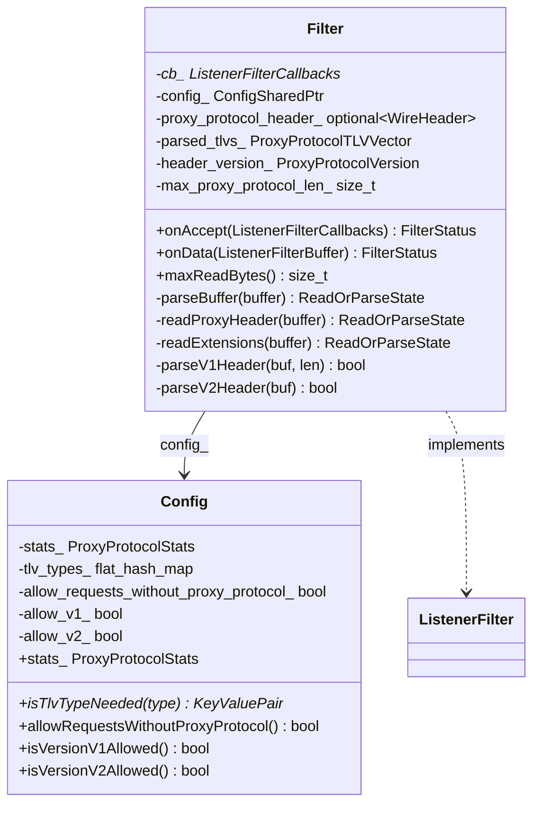
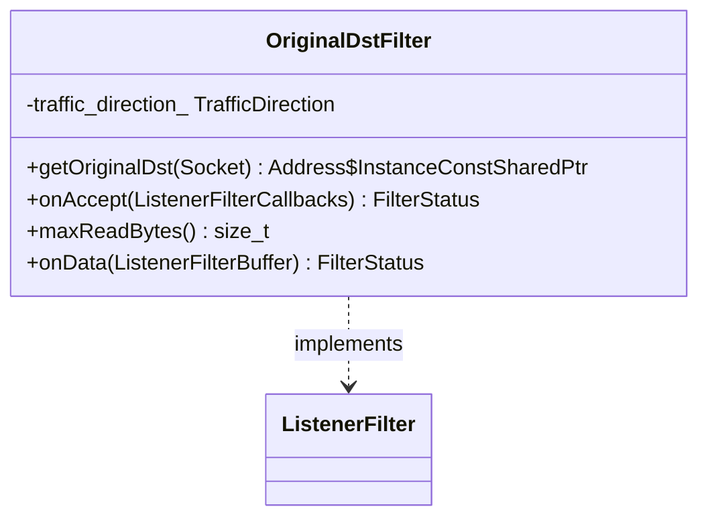
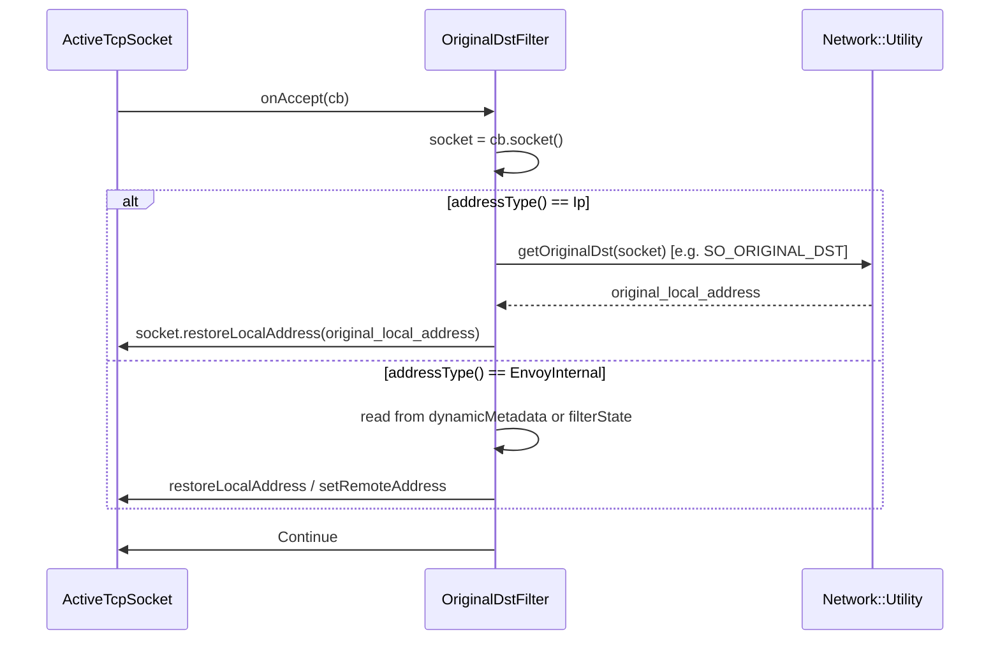
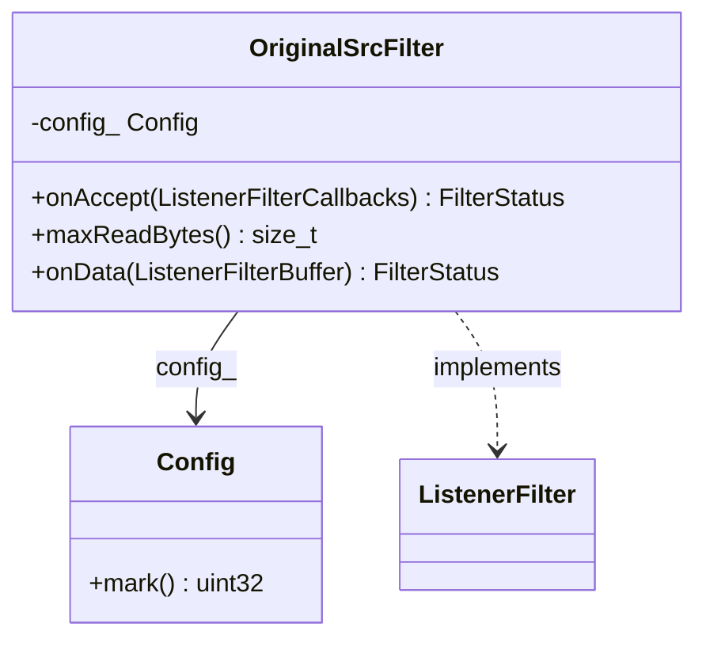
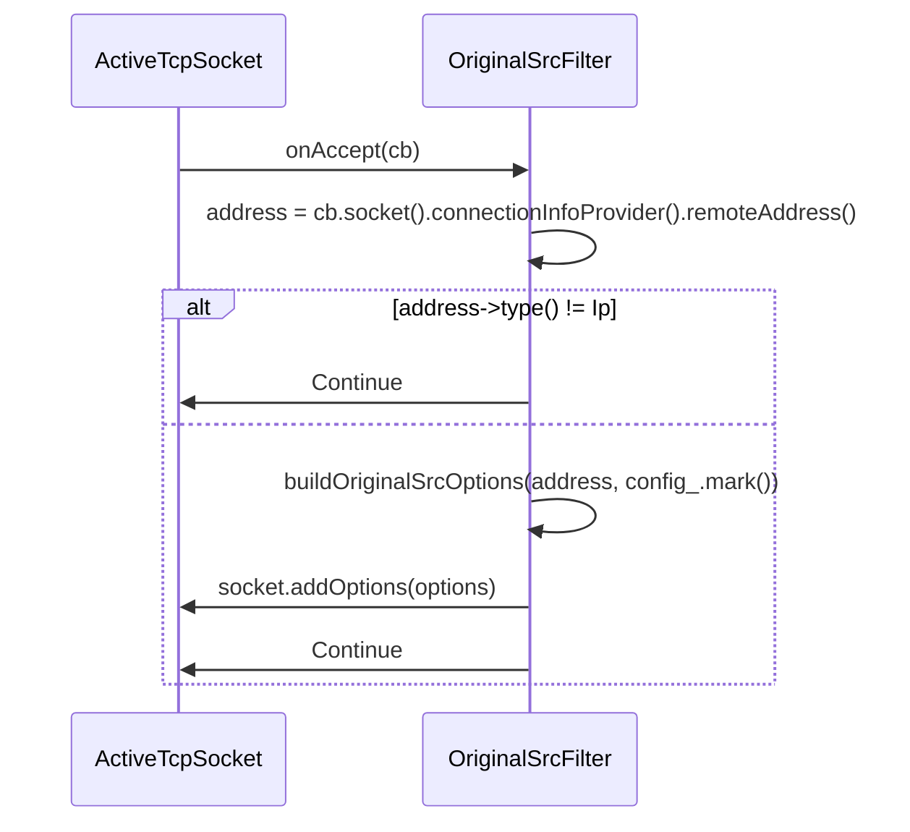
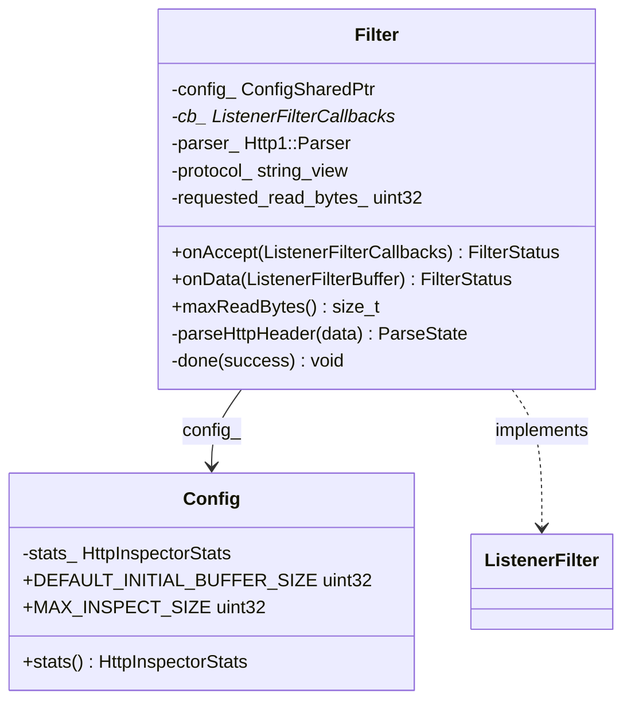
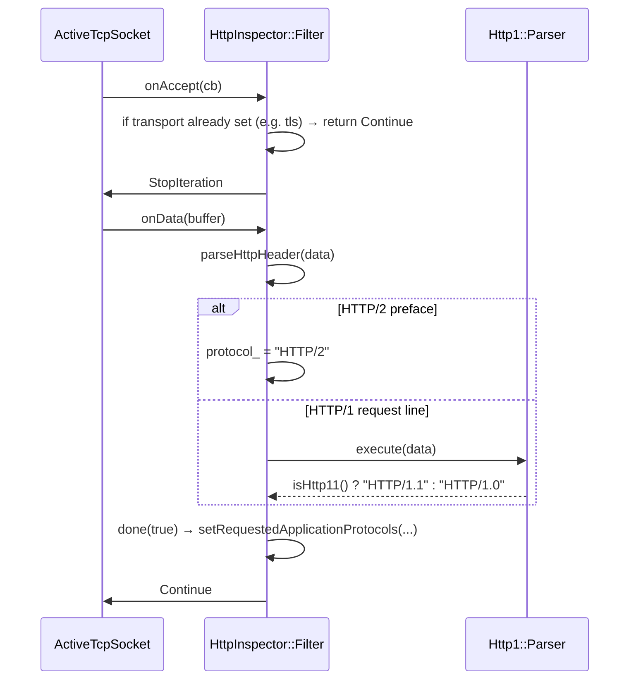
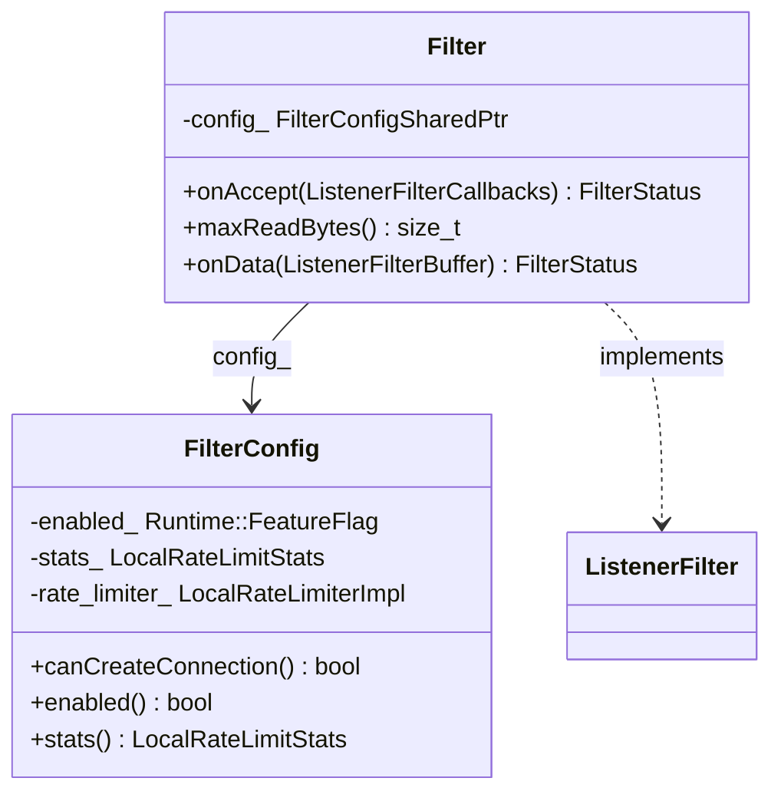
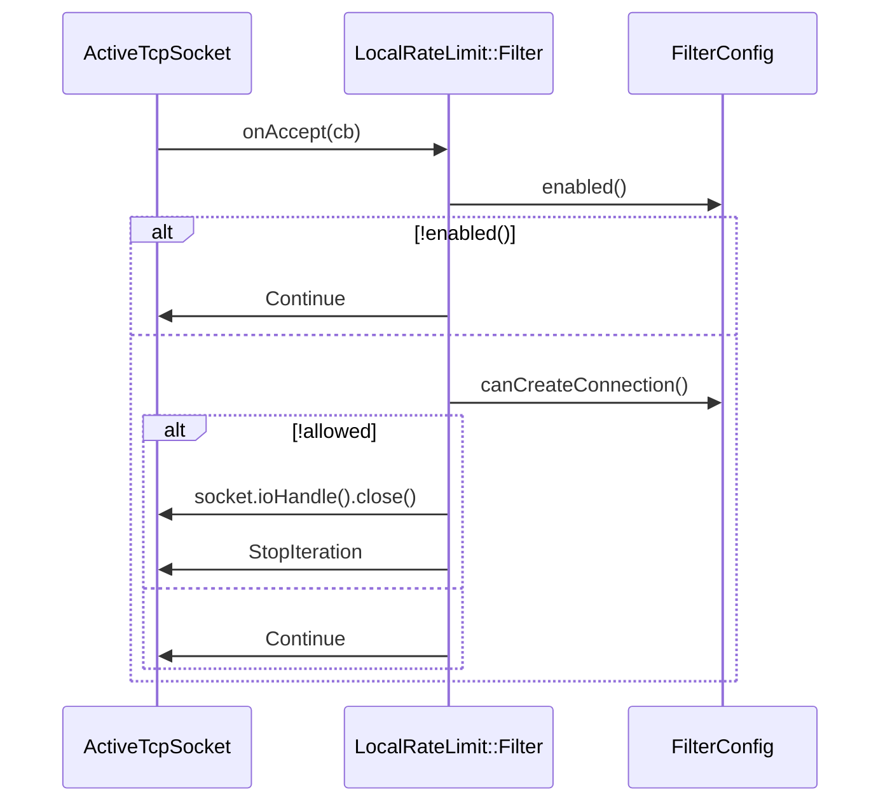

# Part 3: Listener Filters — Built-in Listener Filters

## Table of Contents
1. [TLS Inspector](#1-tls-inspector)
2. [Proxy Protocol](#2-proxy-protocol)
3. [Original Destination](#3-original-destination)
4. [Original Source](#4-original-source)
5. [HTTP Inspector](#5-http-inspector)
6. [Local Rate Limit](#6-local-rate-limit)
7. [Comparison Table](#7-comparison-table)

---

## 1. TLS Inspector

**Purpose:** Peek at the TLS ClientHello to detect TLS vs plaintext and to extract **SNI**, **ALPN**, and optionally **JA3/JA4** fingerprints. Used for filter chain matching (e.g. SNI → different certs) and setting `detectedTransportProtocol()` to `"tls"` or leave as `"raw_buffer"`.

**Files:** `tls_inspector/tls_inspector.h`, `tls_inspector.cc`, `ja4_fingerprint.h/cc`, `config.cc`

### Block Diagram

```
┌─────────────────────────────────────────────────────────────────────────────┐
│  TlsInspector Filter                                                         │
│                                                                              │
│  onAccept(cb)                                                                │
│    → cb_ = &cb                                                               │
│    → return StopIteration (need ClientHello)                                 │
│                                                                              │
│  onData(buffer)                                                              │
│    → parseClientHello(data) via BoringSSL (SSL_do_handshake with early      │
│       select_certificate_cb that returns ssl_select_cert_error)              │
│    → In callback: onALPN(), onServername(), createJA3Hash(), createJA4Hash()│
│    → Set on socket: setRequestedServerName(), setRequestedApplicationProtocols│
│      setDetectedTransportProtocol("tls"), setJA3Hash(), setJA4Hash()         │
│    → ParseState: Done → Continue; Continue → StopIteration; Error → close   │
└─────────────────────────────────────────────────────────────────────────────┘
                              │
                              ▼
┌─────────────────────────────────────────────────────────────────────────────┐
│  Config                                                                      │
│  • SSL_CTX (TLS_with_buffers_method), min/max TLS version                    │
│  • enable_ja3_fingerprinting_, enable_ja4_fingerprinting_                    │
│  • max_client_hello_size_, initial_read_buffer_size_                        │
│  • close_connection_on_client_hello_parsing_errors_                          │
│  • newSsl() → SSL_new(ssl_ctx_)                                              │
└─────────────────────────────────────────────────────────────────────────────┘
```

### UML



### Sequence Diagram

```mermaid
sequenceDiagram
    participant ATS as ActiveTcpSocket
    participant TLS as TlsInspector::Filter
    participant SSL as BoringSSL
    participant Buf as ListenerFilterBuffer

    ATS->>TLS: onAccept(cb)
    TLS->>TLS: cb_ = &cb
    TLS->>ATS: StopIteration

    Note over ATS,Buf: Peek path: buffer gets ClientHello bytes
    ATS->>TLS: onData(buffer)
    TLS->>TLS: parseClientHello(peeked data)
    TLS->>SSL: SSL_set0_rbio(bio); SSL_do_handshake()
    SSL->>TLS: select_certificate_cb (ClientHello parsed)
    TLS->>TLS: onServername(SNI); onALPN(protocols); createJA3Hash(); createJA4Hash()
    TLS->>ATS: cb_->socket().setRequestedServerName(), setRequestedApplicationProtocols, setDetectedTransportProtocol("tls")
    TLS->>ATS: Continue
    ATS->>ATS: continueFilterChain(true)
```

---

## 2. Proxy Protocol

**Purpose:** Parse the HAProxy **PROXY protocol** header (v1 or v2) to get the **real client (remote) and destination (local) addresses** and optional TLV extensions. Updates the socket’s remote/local addresses and can store TLVs in filter state / dynamic metadata.

**Files:** `proxy_protocol/proxy_protocol.h`, `proxy_protocol.cc`, `proxy_protocol_header.h`, `config.cc`

### Block Diagram

```
┌─────────────────────────────────────────────────────────────────────────────┐
│  Proxy Protocol Filter                                                       │
│                                                                              │
│  onAccept(cb) → cb_ = &cb; return StopIteration                              │
│                                                                              │
│  onData(buffer)                                                              │
│    → parseBuffer(buffer)                                                     │
│         → readProxyHeader(): detect V1 ("PROXY ...\r\n") or V2 (0x0D0A0D0A)  │
│         → parseV1Header() / parseV2Header() → remote_address_, local_address_│
│         → readExtensions() if v2 and TLV length > 0                           │
│    → If Done: set ProxyProtocolFilterState; restoreLocalAddress;            │
│               setRemoteAddress; buffer.drain(header_len); return Continue    │
│    → If Error/Denied: close socket; return StopIteration                     │
│    → If TryAgainLater: return StopIteration                                  │
└─────────────────────────────────────────────────────────────────────────────┘
```

### UML



### Sequence Diagram

```mermaid
sequenceDiagram
    participant ATS as ActiveTcpSocket
    participant PP as ProxyProtocol::Filter
    participant Buf as ListenerFilterBuffer

    ATS->>PP: onAccept(cb)
    PP->>ATS: StopIteration

    ATS->>PP: onData(buffer)
    PP->>PP: readProxyHeader() → V1 or V2 or NotFound
    alt V1/V2 found
        PP->>PP: parseV1Header/parseV2Header → remote_address_, local_address_
        PP->>PP: readExtensions() → parsed_tlvs_
        PP->>ATS: filterState().setData(ProxyProtocolFilterState)
        PP->>ATS: socket().restoreLocalAddress(); setRemoteAddress()
        PP->>Buf: drain(header_len)
        PP->>ATS: Continue
    else NotFound, allow_requests_without_proxy_protocol
        PP->>ATS: Continue
    else Error/Denied
        PP->>ATS: socket().ioHandle().close(); StopIteration
    end
```

---

## 3. Original Destination

**Purpose:** For connections that were **redirected by iptables/nat** (e.g. transparent proxy), read the **original destination address** from the kernel (e.g. `SO_ORIGINAL_DST`) and call **`restoreLocalAddress(original_local_address)`** on the socket. Envoy can then hand off the connection to the listener bound to that address (when `use_original_dst` is true). Also supports **Envoy Internal** address type with metadata/filter state for original local/remote.

**Files:** `original_dst/original_dst.h`, `original_dst.cc`, `config.cc`

### Block Diagram

```
┌─────────────────────────────────────────────────────────────────────────────┐
│  OriginalDstFilter                                                           │
│  • maxReadBytes() == 0 → no onData                                           │
│  onAccept(cb)                                                                │
│    → socket.addressType():                                                    │
│      Ip: getOriginalDst(socket) → restoreLocalAddress(original_local)         │
│      EnvoyInternal: get original local/remote from metadata or filter state  │
│        → restoreLocalAddress / setRemoteAddress                              │
│    → return Continue                                                         │
└─────────────────────────────────────────────────────────────────────────────┘
```

### UML



### Sequence Diagram



---

## 4. Original Source

**Purpose:** Record the **downstream (client) address** and attach it as a **socket option** so that upstream connections can use it (e.g. for partitioning or logging). Does not peek; runs entirely in `onAccept`.

**Files:** `original_src/original_src.h`, `original_src.cc`, `config.h/cc`, `original_src_config_factory.h/cc`

### Block Diagram

```
┌─────────────────────────────────────────────────────────────────────────────┐
│  OriginalSrcFilter                                                          │
│  • Config: mark (optional socket option value)                              │
│  onAccept(cb)                                                                │
│    → address = socket.connectionInfoProvider().remoteAddress()               │
│    → If not Ip: return Continue                                              │
│    → buildOriginalSrcOptions(address, config_.mark()) → socket.addOptions()   │
│    → return Continue                                                         │
└─────────────────────────────────────────────────────────────────────────────┘
```

### UML



### Sequence Diagram



---

## 5. HTTP Inspector

**Purpose:** When transport is **not** TLS (e.g. `raw_buffer`), peek at the first bytes to detect **HTTP/1.0**, **HTTP/1.1**, or **HTTP/2** (connection preface) and set **requested application protocols** on the socket (e.g. `http/1.1`, `h2c`). Used for ALPN-based filter chain matching on plaintext ports.

**Files:** `http_inspector/http_inspector.h`, `http_inspector.cc`, `config.cc`

### Block Diagram

```
┌─────────────────────────────────────────────────────────────────────────────┐
│  HttpInspector Filter                                                        │
│  onAccept(cb)                                                                │
│    → If socket.detectedTransportProtocol() != "" and != "raw_buffer"          │
│        → return Continue (skip; e.g. already TLS)                            │
│    → cb_ = &cb; return StopIteration                                         │
│  onData(buffer)                                                              │
│    → parseHttpHeader(data):                                                  │
│        HTTP/2: match "PRI * HTTP/2.0\r\n\r\nSM\r\n\r\n" → protocol_ = "HTTP/2"│
│        HTTP/1: use Http1::Parser (Balsa or Legacy) on request line            │
│          → protocol_ = "HTTP/1.1" or "HTTP/1.0"                               │
│    → done(success): setRequestedApplicationProtocols({ "http/1.1"|"http/1.0"|"h2c" })│
│    → Done → Continue; Continue → StopIteration; Error → Continue (or close)  │
└─────────────────────────────────────────────────────────────────────────────┘
```

### UML



### Sequence Diagram



---

## 6. Local Rate Limit

**Purpose:** **Per-listener** connection rate limiting using a **token bucket**. If the bucket does not allow a new connection, the socket is closed and the filter returns `StopIteration`. No peek; decision is made in `onAccept`.

**Files:** `local_ratelimit/local_ratelimit.h`, `local_ratelimit.cc`, `config.cc`

### Block Diagram

```
┌─────────────────────────────────────────────────────────────────────────────┐
│  Local Rate Limit Filter                                                    │
│  • FilterConfig: token bucket (fill_interval, max_tokens, tokens_per_fill),  │
│    runtime flag enabled_, stats_                                             │
│  onAccept(cb)                                                                │
│    → If !config_->enabled() → return Continue                                │
│    → If !config_->canCreateConnection() → close socket; return StopIteration │
│    → return Continue                                                         │
└─────────────────────────────────────────────────────────────────────────────┘
```

### UML



### Sequence Diagram



---

## 7. Comparison Table

| Filter             | Peek (onData) | maxReadBytes | Typical order | Main output |
|--------------------|---------------|--------------|---------------|-------------|
| **Proxy Protocol** | Yes           | V1/V2 header + TLVs | First (before TLS) | remote/local address, filter state |
| **TLS Inspector**  | Yes           | ClientHello size    | After PROXY       | SNI, ALPN, transport=tls, JA3/JA4 |
| **Original Dst**   | No            | 0            | Any            | restoreLocalAddress(original_dst) |
| **Original Src**   | No            | 0            | Any            | socket options for upstream |
| **HTTP Inspector** | Yes           | Up to 64K    | After TLS (plaintext only) | ALPN http/1.1, h2c, etc. |
| **Local Rate Limit** | No          | 0            | Any            | accept or close socket |
