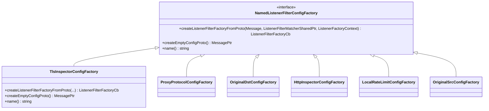
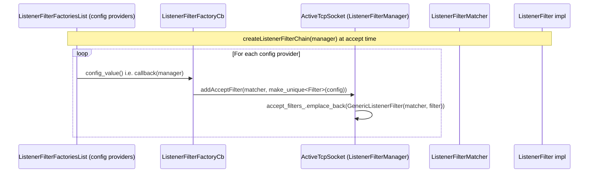
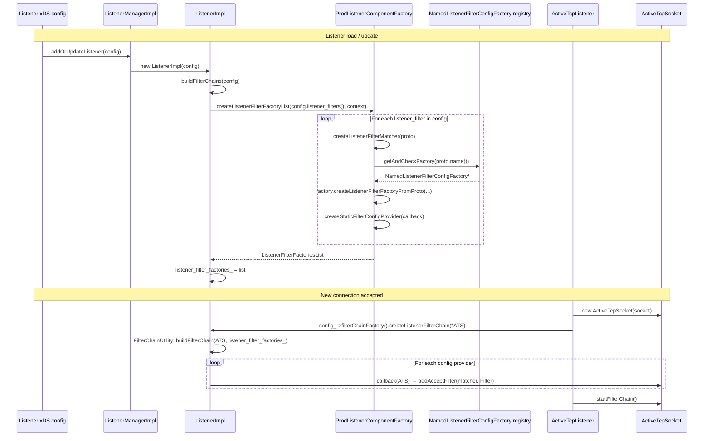

# Part 4: Listener Filters — Configuration and Extension

## Table of Contents
1. [Configuration Flow Overview](#configuration-flow-overview)
2. [Block Diagram: From Listener Proto to Filter Chain](#block-diagram-from-listener-proto-to-filter-chain)
3. [NamedListenerFilterConfigFactory](#namedlistenerfilterconfigfactory)
4. [UML: Config Factory and Listener Filter Registration](#uml-config-factory-and-listener-filter-registration)
5. [Listener Filter Matchers](#listener-filter-matchers)
6. [Sequence Diagram: Listener Startup and New Connection](#sequence-diagram-listener-startup-and-new-connection)
7. [Dynamic Listener Filter Configuration (ECDS)](#dynamic-listener-filter-configuration-ecds)
8. [Dynamic Modules Extension](#dynamic-modules-extension)

---

## Configuration Flow Overview

Listener filters are configured on the **Listener** in the xDS/listener config:

- **`listener_filters`** — ordered list of `ListenerFilter` entries, each with:
  - **name** — e.g. `envoy.filters.listener.tls_inspector`
  - **typed_config** — filter-specific proto (e.g. `TlsInspector`)
  - **filter_disabled** (optional) — match predicate; when it matches, this filter is **disabled** for that connection
  - **config_discovery** (optional) — for dynamic (ECDS) config

At listener **build** time:

1. **ListenerImpl::buildFilterChains()** (and related) calls the component factory to create **ListenerFilterFactoriesList** from `config.listener_filters()`.
2. For each entry, the **NamedListenerFilterConfigFactory** for that name is looked up; **createListenerFilterFactoryFromProto()** returns a **ListenerFilterFactoryCb** (a callback that takes `ListenerFilterManager&` and calls **addAcceptFilter(matcher, filter)**).
3. A **ListenerFilterMatcher** is built from the proto (e.g. from **filter_disabled**); if no predicate is set, an **any** matcher (always match) is used.
4. The list of callbacks is stored as **listener_filter_factories_** on the listener.

At **accept** time:

1. **ActiveTcpListener::onAccept(socket)** creates an **ActiveTcpSocket(socket)**.
2. **config_->filterChainFactory().createListenerFilterChain(*active_socket)** is called — i.e. **ListenerImpl::createListenerFilterChain(manager)**.
3. **FilterChainUtility::buildFilterChain(manager, listener_filter_factories_)** runs: for each factory, **config_value(filter_manager)** is invoked, so each callback calls **filter_manager.addAcceptFilter(listener_filter_matcher, std::make_unique<Filter>(config))** (or equivalent).
4. **active_socket->startFilterChain()** runs the chain (see Part 2).

---

## Block Diagram: From Listener Proto to Filter Chain

```
┌─────────────────────────────────────────────────────────────────────────────────┐
│  Listener (xDS / static)                                                         │
│  listener_filters:                                                               │
│    - name: envoy.filters.listener.proxy_protocol                                 │
│      typed_config: { ... }                                                       │
│    - name: envoy.filters.listener.tls_inspector                                  │
│      typed_config: { ... }                                                       │
│    - name: envoy.filters.listener.original_dst                                   │
│      typed_config: {}                                                            │
└─────────────────────────────────────────────────────────────────────────────────┘
                                        │
                    ListenerImpl::buildFilterChains() / addFilterChains
                                        │
                                        ▼
┌─────────────────────────────────────────────────────────────────────────────────┐
│  ProdListenerComponentFactory::createListenerFilterFactoryListImpl()             │
│  For each listener_filters[i]:                                                   │
│    • createListenerFilterMatcher(proto) → ListenerFilterMatcherPtr                │
│    • getAndCheckFactory<NamedListenerFilterConfigFactory>(proto)                  │
│    • factory.createListenerFilterFactoryFromProto(message, matcher, context)     │
│      → ListenerFilterFactoryCb                                                   │
│    • createStaticFilterConfigProvider(callback, name) → FilterConfigProvider     │
│  Result: listener_filter_factories_ (list of config providers)                   │
└─────────────────────────────────────────────────────────────────────────────────┘
                                        │
                    Stored in ListenerImpl::listener_filter_factories_
                                        │
          On accept: createListenerFilterChain(ActiveTcpSocket)
                                        │
                                        ▼
┌─────────────────────────────────────────────────────────────────────────────────┐
│  FilterChainUtility::buildFilterChain(manager, listener_filter_factories_)         │
│  For each config_provider: config_value(manager)                                 │
│    → callback(manager) → manager.addAcceptFilter(matcher, unique_ptr<Filter>)   │
└─────────────────────────────────────────────────────────────────────────────────┘
                                        │
                                        ▼
┌─────────────────────────────────────────────────────────────────────────────────┐
│  ActiveTcpSocket::accept_filters_ = [ (matcher, Filter), ... ]                   │
│  startFilterChain() → iterate and run onAccept / onData                           │
└─────────────────────────────────────────────────────────────────────────────────┘
```

---

## NamedListenerFilterConfigFactory

Every built-in listener filter is registered as a **NamedListenerFilterConfigFactory** and provides:

- **createListenerFilterFactoryFromProto(Message, ListenerFilterMatcherSharedPtr, ListenerFactoryContext)**  
  Returns a **ListenerFilterFactoryCb**: a `void(ListenerFilterManager&)` that calls **filter_manager.addAcceptFilter(matcher, std::make_unique<Filter>(config))**.
- **createEmptyConfigProto()**  
  Returns an empty proto for the filter (for validation / ECDS default).
- **name()**  
  String name used in config (e.g. `envoy.filters.listener.tls_inspector`).

Example (TLS Inspector):

```cpp
// config.cc
class TlsInspectorConfigFactory : public Server::Configuration::NamedListenerFilterConfigFactory {
  Network::ListenerFilterFactoryCb createListenerFilterFactoryFromProto(
      const Protobuf::Message& message, const Network::ListenerFilterMatcherSharedPtr& listener_filter_matcher, Server::Configuration::ListenerFactoryContext& context) override {
    const auto& proto_config = MessageUtil::downcastAndValidate<...>(message, ...);
    ConfigSharedPtr config = std::make_shared<Config>(context.scope(), proto_config);
    return [listener_filter_matcher, config](Network::ListenerFilterManager& filter_manager) -> void {
      filter_manager.addAcceptFilter(listener_filter_matcher, std::make_unique<Filter>(config));
    };
  }
  ProtobufTypes::MessagePtr createEmptyConfigProto() override {
    return std::make_unique<...::TlsInspector>(); }
  std::string name() const override {
    return "envoy.filters.listener.tls_inspector"; }
};
REGISTER_FACTORY(TlsInspectorConfigFactory, Server::Configuration::NamedListenerFilterConfigFactory){"envoy.listener.tls_inspector"};
```

The **second** string in `REGISTER_FACTORY` is the deprecated/alternate name used in listener config (e.g. `envoy.listener.tls_inspector`).

---

## UML: Config Factory and Listener Filter Registration





---

## Listener Filter Matchers

A **ListenerFilterMatcher** decides whether a given listener filter **runs** for a connection. It is built from the **ListenerFilterChainMatchPredicate** (e.g. from **filter_disabled**). When the predicate **matches**, the filter is **disabled** (skipped); when it does not match, the filter runs. The wrapper (**GenericListenerFilter**) calls **matcher->matches(cb)** before **onAccept**; if the matcher says “match” (e.g. “filter_disabled” matches), the filter is skipped and the chain continues as if the filter returned **Continue**.

**Matcher types** (in `source/common/network/filter_matcher.h`):

| Class | Proto / config | matches(cb) |
|-------|----------------|-------------|
| **ListenerFilterAnyMatcher** | (default) | Always true |
| **ListenerFilterNotMatcher** | not_match | !sub_matcher_->matches(cb) |
| **ListenerFilterDstPortMatcher** | destination_port_range | local address port in [start, end) |
| **ListenerFilterAndMatcher** | and_match | All sub_predicates match |
| **ListenerFilterOrMatcher** | or_match | Any sub_predicate matches |

So you can disable a listener filter for certain destination ports (e.g. don’t run TLS inspector on port 80).

Block diagram:

```
┌─────────────────────────────────────────────────────────────────────────────────┐
│  GenericListenerFilter::onAccept(callbacks)                                      │
│    if (!matcher_->matches(callbacks))  →  run listener_filter_->onAccept(cb)     │
│    else                                →  return Continue (skip filter)          │
└─────────────────────────────────────────────────────────────────────────────────┘
```

---

## Sequence Diagram: Listener Startup and New Connection



---

## Dynamic Listener Filter Configuration (ECDS)

Listener filters can be configured via **ECDS** (Extension Config Discovery Service) by setting **config_discovery** on the **ListenerFilter** proto instead of **typed_config**:

- **config_discovery** — `ExtensionConfigSource` (e.g. ADS, path) and **type_urls** (e.g. type URL for the filter’s proto).
- The component factory creates a **dynamic** filter config provider that subscribes to ECDS; when config is received, the provider’s callback is updated.
- When **createListenerFilterChain** runs, each provider’s **current** callback is invoked; if config is not yet available, **buildFilterChain** can return false and the connection may be closed or handled according to **apply_default_config_without_warming** / default config.

Static vs dynamic:

- **Static:** `typed_config` → single **createListenerFilterFactoryFromProto** at listener build → **createStaticFilterConfigProvider(callback)**.
- **Dynamic:** **config_discovery** + **type_urls** → **createDynamicFilterConfigProvider(...)** → callback updated when ECDS pushes new config.

---

## Dynamic Modules Extension

The **dynamic_modules** listener filter (`source/extensions/filters/listener/dynamic_modules/`) allows loading **listener filter logic from a shared library** (dynamic module) that implements the Envoy listener filter ABI. The filter:

- Loads a **DynamicModule** and calls **on_listener_filter_new**, **on_listener_filter_on_accept**, **on_listener_filter_on_data**, **on_listener_filter_get_max_read_bytes**, **on_listener_filter_on_close**, **on_listener_filter_destroy**.
- Wraps the module in a **DynamicModuleListenerFilterConfig** and a **Filter** that implements **ListenerFilter** and delegates to the module.
- Supports **scheduled** callbacks (e.g. run on main thread) via **DynamicModuleListenerFilterConfigScheduler**.

So you can add custom listener filters without recompiling Envoy by building a compatible shared library and configuring the **envoy.filters.listener.dynamic_modules** filter with the module and its config.

---

## Summary

| Topic | Location | Summary |
|-------|----------|---------|
| **Listener config** | Listener.listener_filters | Ordered list of name + typed_config (or config_discovery) |
| **Factory** | NamedListenerFilterConfigFactory | createListenerFilterFactoryFromProto → ListenerFilterFactoryCb |
| **Registration** | REGISTER_FACTORY(..., NamedListenerFilterConfigFactory) | Name and deprecated name |
| **Matcher** | ListenerFilterMatcherBuilder, filter_matcher.h | Any, Not, DstPort, And, Or; used to skip filter when predicate matches |
| **Installation** | createListenerFilterChain → buildFilterChain → addAcceptFilter | Per-accept: each factory adds one (matcher, Filter) to ActiveTcpSocket |
| **ECDS** | config_discovery on ListenerFilter | Dynamic filter config via xDS |
| **Dynamic modules** | dynamic_modules/ | Listener filter implemented in external shared library |
