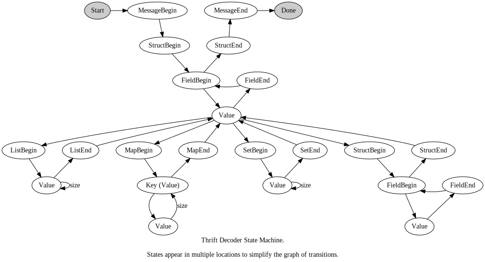

Thrift Decoder State Machine
============================

Decoding Thrift messages can be visualized as a series of state
transitions. Each state corresponds to the invocation of a function on
the `ThriftProxy::Protocol` interface. Not pictured in the state
diagram is the transient `WaitForData` state which implies that
insufficient data was available to process a state and that the state
machine should be resumed when more data is available.

The `Value` states in the diagram are represented by multiple states
in the actual state machine (`FieldValue`, `ListValue`, `MapKey`,
`MapValue`, and `SetValue`). The various value states encode the
transition from, for example, a list value (`ListValue`) to the
`ListEnd` state.

The state machine tracks "frames" which allow the state machine to
record information about nested lists, maps, sets, and
structures. Thrift allows these data types to be nested in arbitrary
combinations and the frame records the state to return to at the end
of each type. For lists, maps, and sets the frame also records the
number of remaining elements.
