# Envoy Server Architecture Documentation

## Overview

This document provides comprehensive documentation for the core server classes in the `source/server` directory. These classes form the backbone of Envoy's server architecture, handling everything from initialization and configuration to worker thread management and graceful shutdown.

## Table of Contents

1. [Architecture Overview](#architecture-overview)
2. [Core Server Classes](#core-server-classes)
3. [Class Hierarchy](#class-hierarchy)
4. [Component Interactions](#component-interactions)
5. [Detailed Class Documentation](#detailed-class-documentation)

---

## Architecture Overview

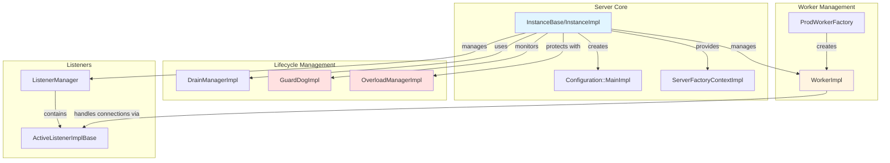

---

## Core Server Classes

### Class Hierarchy

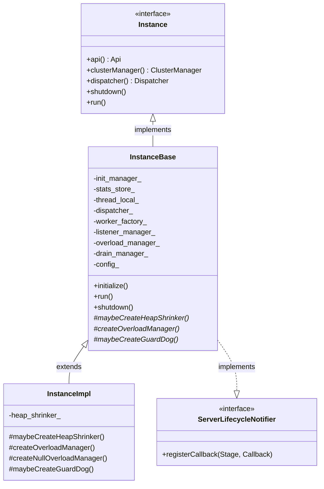

---

## Component Interactions

### Server Initialization Flow

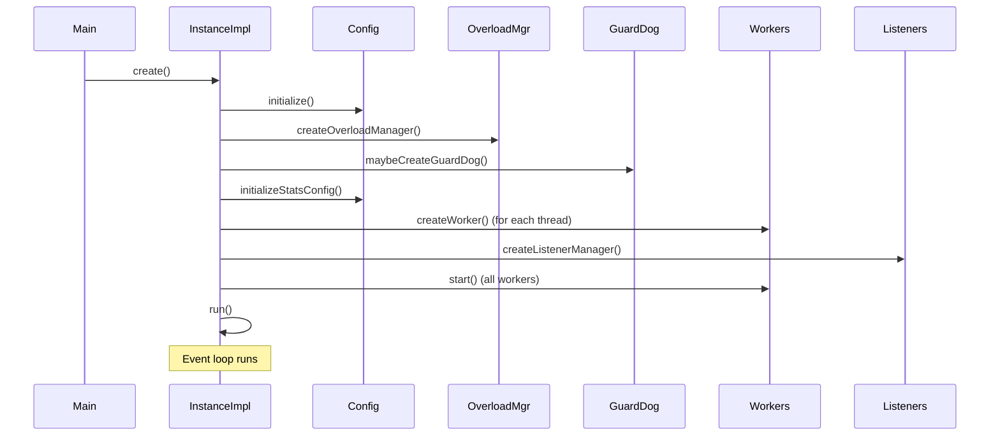

### Worker Thread Architecture

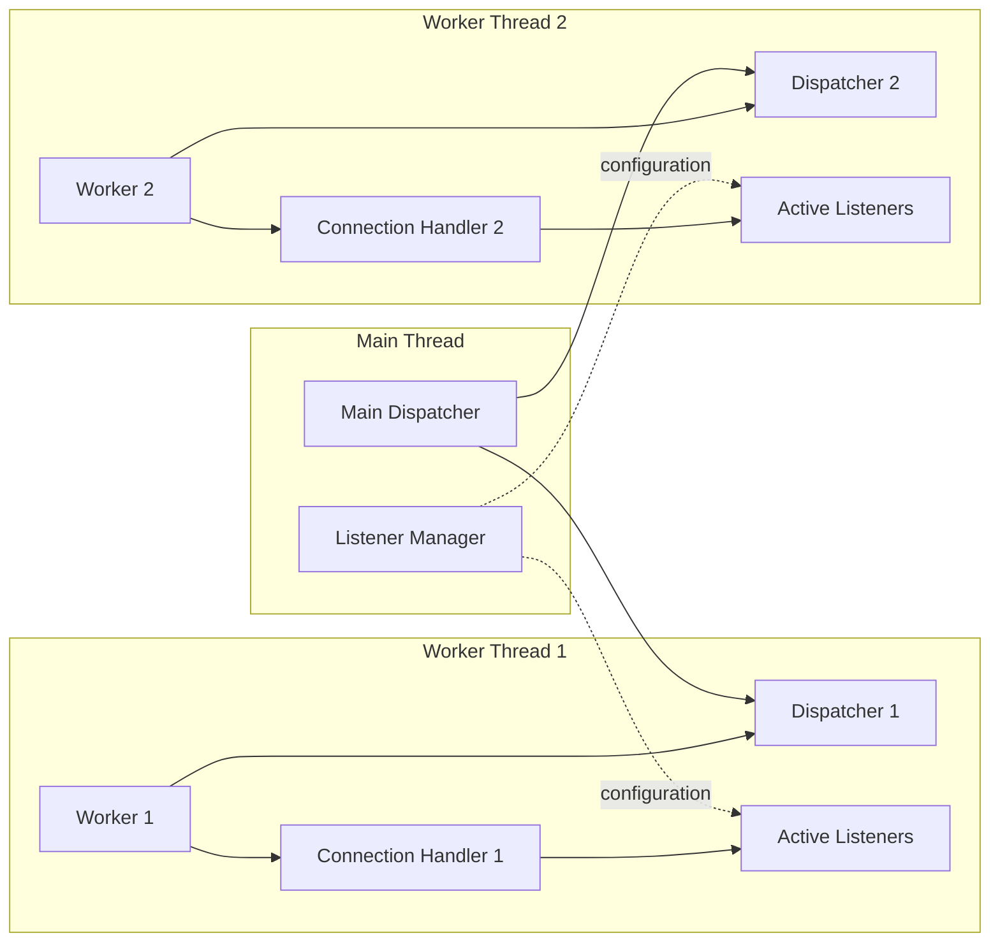

### Graceful Shutdown Flow

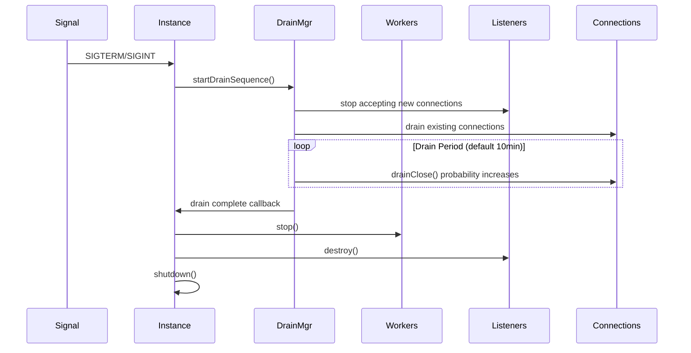

---

## Detailed Class Documentation

### 1. InstanceBase / InstanceImpl

**File:** `source/server/server.h`, `source/server/instance_impl.h`

**Purpose:** The core server instance that orchestrates all components of Envoy. `InstanceBase` provides the common implementation, while `InstanceImpl` is the production variant.

**Key Responsibilities:**
- Server initialization and lifecycle management
- Component creation and orchestration (clusters, listeners, workers)
- Configuration management
- Stats and metrics collection
- Hot restart coordination

**Important Members:**

```cpp
// Core dependencies
Init::Manager& init_manager_;                    // Initialization manager
Stats::StoreRoot& stats_store_;                  // Statistics store
ThreadLocal::Instance& thread_local_;            // Thread-local storage
Event::DispatcherPtr dispatcher_;                // Main thread event dispatcher

// Component managers
std::unique_ptr<Runtime::Loader> runtime_;       // Runtime configuration
ProdWorkerFactory worker_factory_;               // Factory for creating workers
std::unique_ptr<ListenerManager> listener_manager_; // Listener management
std::unique_ptr<OverloadManager> overload_manager_; // Resource overload protection
DrainManagerPtr drain_manager_;                  // Graceful shutdown manager
Configuration::MainImpl config_;                 // Main configuration
```

**Key Methods:**

```cpp
// Initialize the server with configuration
void initialize(Network::Address::InstanceConstSharedPtr local_address,
                ComponentFactory& component_factory);

// Start the server event loop
void run() override;

// Gracefully shutdown the server
void shutdown() override;

// Lifecycle notifications
ServerLifecycleNotifier::HandlePtr registerCallback(
    Stage stage, StageCallback callback) override;
```

**Lifecycle Stages:**

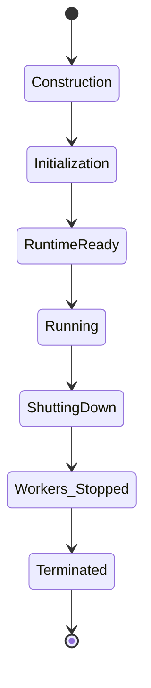

---

### 2. WorkerImpl

**File:** `source/server/worker_impl.h`

**Purpose:** Represents a worker thread that handles network connections using its own event dispatcher.

**Key Responsibilities:**
- Run event loop in dedicated thread
- Handle connections assigned to this worker
- Manage listeners on this worker thread
- Respond to overload conditions

**Important Members:**

```cpp
ThreadLocal::Instance& tls_;                     // Thread-local storage
Event::DispatcherPtr dispatcher_;                // Worker's event dispatcher
Network::ConnectionHandlerPtr handler_;          // Connection handler
Api::Api& api_;                                  // API for system calls
Thread::ThreadPtr thread_;                       // Worker thread
WatchDogSharedPtr watch_dog_;                    // Watchdog for this worker
```

**Key Methods:**

```cpp
// Add a listener to this worker
void addListener(absl::optional<uint64_t> overridden_listener,
                Network::ListenerConfig& listener,
                AddListenerCompletion completion,
                Runtime::Loader& loader,
                Random::RandomGenerator& random) override;

// Start the worker thread
void start(OptRef<GuardDog> guard_dog,
          const std::function<void()>& cb) override;

// Stop accepting new connections (overload response)
void stopAcceptingConnectionsCb(OverloadActionState state);

// Reset streams using excessive memory (overload response)
void resetStreamsUsingExcessiveMemory(OverloadActionState state);
```

**Worker Thread Lifecycle:**

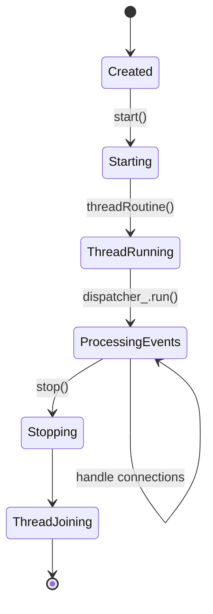

---

### 3. GuardDogImpl

**File:** `source/server/guarddog_impl.h`

**Purpose:** Deadlock detection and thread starvation monitoring. Ensures worker threads and the main thread are making progress.

**Key Responsibilities:**
- Monitor thread liveliness via periodic check-ins
- Detect thread starvation (miss timeout)
- Detect potential deadlocks (mega-miss timeout)
- Execute configured actions on timeout (log, abort, etc.)

**Configuration Timeouts:**

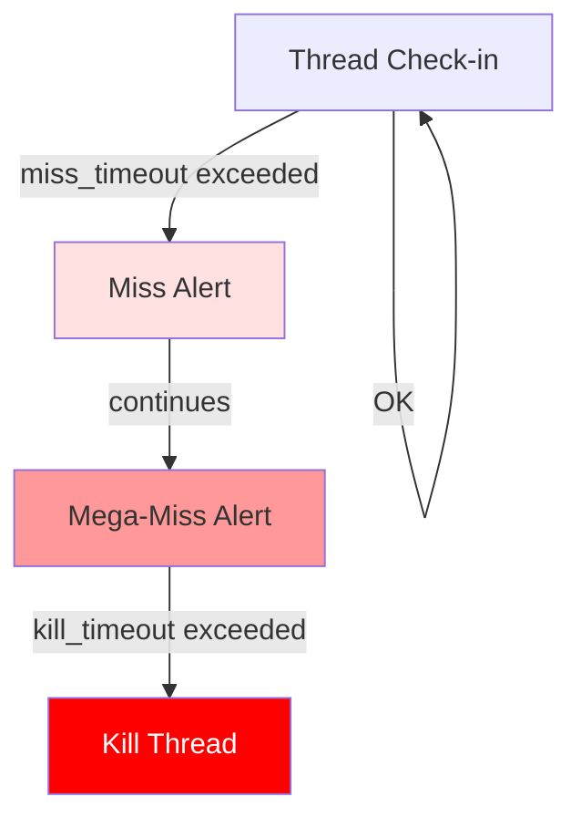

**Important Members:**

```cpp
const std::chrono::milliseconds miss_timeout_;       // Time for "miss" alert
const std::chrono::milliseconds megamiss_timeout_;   // Time for "megamiss" alert
const std::chrono::milliseconds kill_timeout_;       // Time before killing thread
const std::chrono::milliseconds multi_kill_timeout_; // Multi-thread kill threshold
const double multi_kill_fraction_;                   // Fraction for multi-kill

std::vector<WatchedDogPtr> watched_dogs_;           // Monitored watchdogs
Thread::ThreadPtr thread_;                          // GuardDog's own thread
Event::DispatcherPtr dispatcher_;                   // GuardDog's dispatcher
Event::TimerPtr loop_timer_;                        // Periodic check timer
```

**Key Methods:**

```cpp
// Create a watchdog for a thread
WatchDogSharedPtr createWatchDog(Thread::ThreadId thread_id,
                                const std::string& thread_name,
                                Event::Dispatcher& dispatcher) override;

// Stop watching a thread
void stopWatching(WatchDogSharedPtr wd) override;
```

---

### 4. OverloadManagerImpl

**File:** `source/server/overload_manager_impl.h`

**Purpose:** Monitors system resources and takes protective actions when resources are exhausted.

**Key Responsibilities:**
- Monitor resource usage (memory, CPU, file descriptors, etc.)
- Track resource pressure via triggers
- Execute overload actions when thresholds are crossed
- Provide load shedding points
- Scale timers based on resource pressure

**Architecture:**

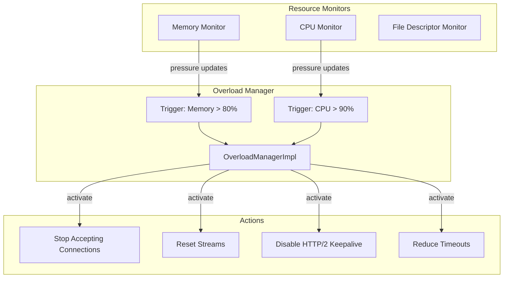

**Important Members:**

```cpp
// Resource monitors
absl::node_hash_map<std::string, Resource> resources_;

// Actions to take on overload
absl::node_hash_map<Symbol, std::unique_ptr<OverloadAction>> actions_;

// Load shed points
absl::flat_hash_map<std::string, std::unique_ptr<LoadShedPointImpl>> loadshed_points_;

// Action callbacks by worker
ActionToCallbackMap action_to_callbacks_;

// Resource pressure updates
const std::chrono::milliseconds refresh_interval_;
Event::TimerPtr timer_;
```

**Key Methods:**

```cpp
// Start monitoring resources
void start() override;

// Register callback for an overload action
bool registerForAction(const std::string& action,
                      Event::Dispatcher& dispatcher,
                      OverloadActionCb callback) override;

// Get load shed point for request rejection
LoadShedPoint* getLoadShedPoint(absl::string_view point_name) override;

// Get factory for scaled timers
Event::ScaledRangeTimerManagerFactory scaledTimerFactory() override;
```

**Overload Action States:**

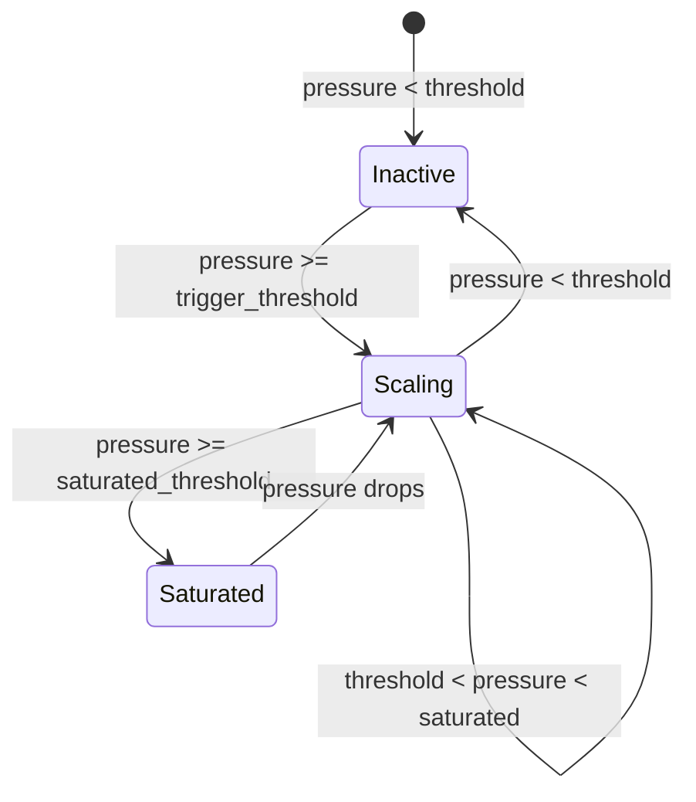

---

### 5. Configuration::MainImpl

**File:** `source/server/configuration_impl.h`

**Purpose:** Main configuration holder for the server, created from the bootstrap configuration.

**Key Responsibilities:**
- Initialize and hold cluster manager
- Configure stats sinks and flush intervals
- Configure watchdog timeouts
- Initialize tracing configuration

**Important Members:**

```cpp
std::unique_ptr<Upstream::ClusterManager> cluster_manager_;
std::unique_ptr<StatsConfigImpl> stats_config_;
std::unique_ptr<Watchdog> main_thread_watchdog_;
std::unique_ptr<Watchdog> worker_watchdog_;
```

**Key Methods:**

```cpp
// Initialize all configuration
absl::Status initialize(const envoy::config::bootstrap::v3::Bootstrap& bootstrap,
                       Instance& server,
                       Upstream::ClusterManagerFactory& cluster_manager_factory);

// Accessors
Upstream::ClusterManager* clusterManager() override;
StatsConfig& statsConfig() override;
const Watchdog& mainThreadWatchdogConfig() const override;
const Watchdog& workerWatchdogConfig() const override;
```

---

### 6. DrainManagerImpl

**File:** `source/server/drain_manager_impl.h`

**Purpose:** Manages graceful shutdown by draining connections over a configurable period.

**Key Responsibilities:**
- Control when to start draining connections
- Implement probabilistic connection draining
- Support parent process shutdown during hot restart
- Cascade drain signals to child drain managers

**Drain Probability Over Time:**

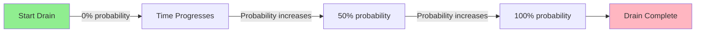

**Important Members:**

```cpp
Instance& server_;
Event::Dispatcher& dispatcher_;
const envoy::config::listener::v3::Listener::DrainType drain_type_;

std::atomic<DrainPair> draining_;               // Current drain state
std::map<Network::DrainDirection, Event::TimerPtr> drain_tick_timers_;
std::map<Network::DrainDirection, MonotonicTime> drain_deadlines_;
std::vector<std::function<void()>> drain_complete_cbs_;
```

**Key Methods:**

```cpp
// Check if a connection should be drained
bool drainClose(Network::DrainDirection scope) const override;

// Start the drain sequence
void startDrainSequence(Network::DrainDirection direction,
                       std::function<void()> drain_complete_cb) override;

// Check if currently draining
bool draining(Network::DrainDirection direction) const override;

// Start parent process shutdown (hot restart)
void startParentShutdownSequence() override;
```

**Drain Types:**

```cpp
enum DrainType {
    DEFAULT,    // Gradual probabilistic drain (default)
    MODIFY_ONLY // Drain only when connections are modified
};
```

---

### 7. FactoryContextImpl

**File:** `source/server/factory_context_impl.h`

**Purpose:** Provides context and dependencies for filter and extension factories.

**Key Responsibilities:**
- Provide access to server components
- Scope stats to listener or filter level
- Provide initialization manager
- Provide drain decision access

**Hierarchy:**

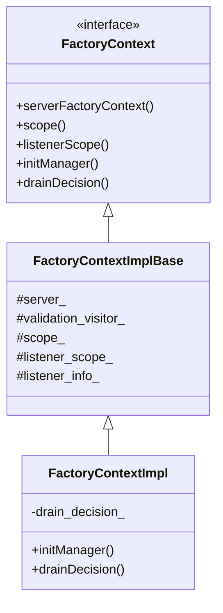

**Important Members:**

```cpp
Server::Instance& server_;                       // Server instance
ProtobufMessage::ValidationVisitor& validation_visitor_;
Stats::ScopeSharedPtr scope_;                   // Listener scope (no prefix)
Stats::ScopeSharedPtr listener_scope_;          // Listener scope (with prefix)
Network::ListenerInfoConstSharedPtr listener_info_;
Network::DrainDecision& drain_decision_;        // For draining
```

---

### 8. ActiveListenerImplBase

**File:** `source/server/active_listener_base.h`

**Purpose:** Base class for active listeners that accept connections on worker threads.

**Key Responsibilities:**
- Track listener-level statistics
- Track per-worker listener statistics
- Provide access to listener configuration

**Important Members:**

```cpp
ListenerStats stats_;                           // Listener-level stats
PerHandlerListenerStats per_worker_stats_;      // Per-worker stats
Network::ListenerConfig* config_;               // Listener configuration
```

**Listener Statistics:**

```cpp
// Listener-level stats (shared across workers)
- downstream_cx_total          // Total connections
- downstream_cx_destroy        // Destroyed connections
- downstream_cx_active         // Active connections
- downstream_cx_length_ms      // Connection duration
- downstream_cx_overflow       // Rejected due to limits

// Per-worker stats
- downstream_cx_total          // Total for this worker
- downstream_cx_active         // Active on this worker
```

---

## Design Patterns

### 1. RAII (Resource Acquisition Is Initialization)

Used extensively for lifecycle management:

```cpp
class InstanceBase {
    // Components are created in constructor, destroyed in destructor
    std::unique_ptr<Secret::SecretManager> secret_manager_;  // Destroyed first
    std::unique_ptr<ListenerManager> listener_manager_;      // May reference secrets
    Event::DispatcherPtr dispatcher_;                        // May have active connections
};
```

### 2. Factory Pattern

Used for creating components:

```cpp
class ComponentFactory {
    virtual DrainManagerPtr createDrainManager(Instance& server) PURE;
    virtual Runtime::LoaderPtr createRuntime(Instance& server,
                                            Configuration::Initial& config) PURE;
};

class ProdWorkerFactory : public WorkerFactory {
    WorkerPtr createWorker(uint32_t index,
                          OverloadManager& overload_manager,
                          const std::string& worker_name) override;
};
```

### 3. Observer Pattern

Used for lifecycle notifications:

```cpp
class ServerLifecycleNotifier {
    virtual HandlePtr registerCallback(Stage stage,
                                      StageCallback callback) PURE;
};

// Usage
server.lifecycleNotifier().registerCallback(
    Stage::PostInit,
    [this] { onServerInitialized(); }
);
```

### 4. Thread-Per-Core

Each worker thread has its own:
- Event dispatcher
- Connection handler
- Thread-local storage

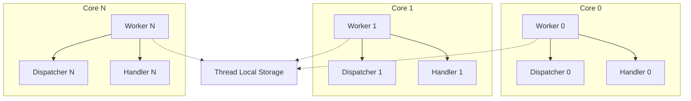

---

## Key Interactions

### Configuration Loading and Initialization

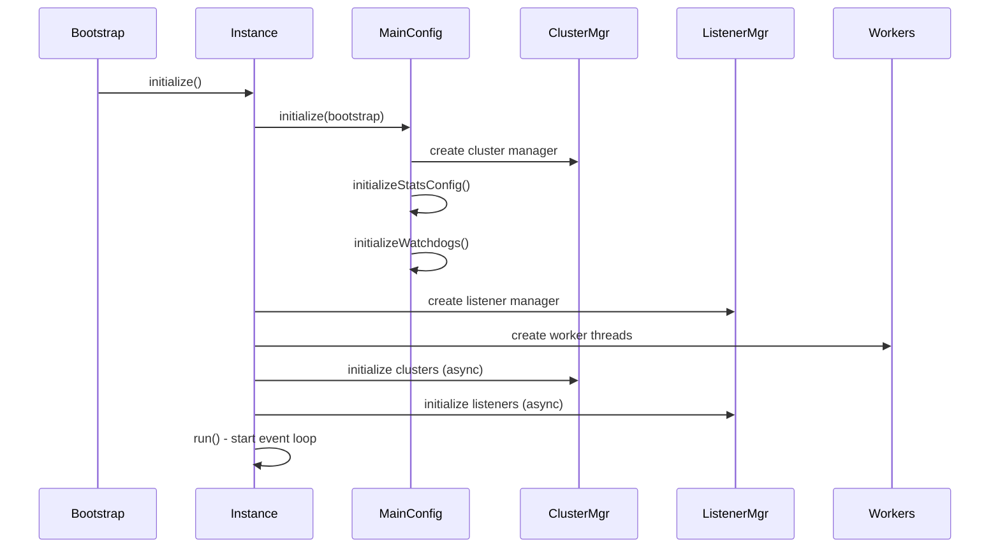

### Overload Protection Flow

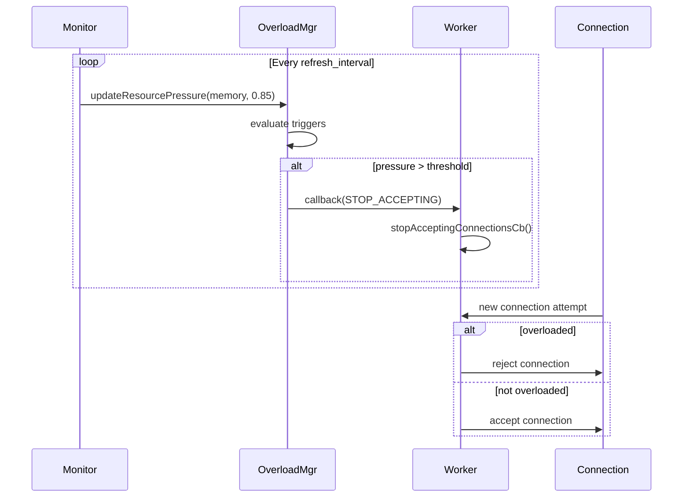

---

## Testing Considerations

### Key Test Utilities

1. **MockInstance** - Mock server instance for testing
2. **TestGuardDog** - Synchronous guard dog for deterministic tests
3. **MockOverloadManager** - Controllable overload state
4. **IntegrationTest** - Full server integration tests

### Integration Test Flow

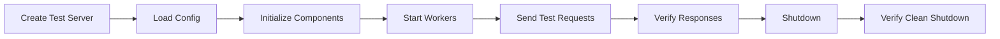

---

## Common Pitfalls

### 1. Component Destruction Order

**Problem:** Components may reference each other during destruction.

**Solution:** Carefully order member variables and use `std::unique_ptr` to control destruction order.

```cpp
class InstanceBase {
private:
    // Destroyed last (other components may reference it)
    std::unique_ptr<Secret::SecretManager> secret_manager_;

    // May reference secrets during destruction
    std::unique_ptr<ListenerManager> listener_manager_;

    // May have active connections referencing the above
    Event::DispatcherPtr dispatcher_;
};
```

### 2. Thread Safety

**Problem:** Components accessed from multiple threads without synchronization.

**Solution:** Use thread-local storage, post callbacks to correct dispatcher, or use locks.

```cpp
// Instead of directly accessing from worker thread:
// server.stats().counter("foo").inc();  // WRONG!

// Post to main thread:
dispatcher_.post([this] {
    server_.stats().counter("foo").inc();  // OK
});
```

### 3. Circular Dependencies

**Problem:** Two components holding shared_ptr to each other causing memory leaks.

**Solution:** Use weak_ptr for back-references or explicit lifecycle management.

---

## Performance Considerations

### 1. Lock-Free Operations

- Thread-local storage avoids locks for stats
- Atomic operations for state flags
- RCU-like patterns for configuration updates

### 2. Memory Pools

- Pre-allocated connection pools
- Buffer pool for network I/O
- Object pools for frequently allocated objects

### 3. Event-Driven Architecture

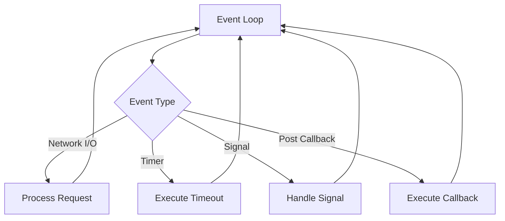

---

## Future Extensions

Areas for potential enhancement:

1. **Pluggable Worker Implementations** - Support different threading models
2. **Enhanced Overload Actions** - More granular protection strategies
3. **Dynamic Configuration** - Hot-reload without restart
4. **Improved Observability** - Better introspection into server state

---

## References

- [Envoy Threading Model](https://www.envoyproxy.io/docs/envoy/latest/intro/arch_overview/intro/threading_model)
- [Envoy Lifecycle Events](https://www.envoyproxy.io/docs/envoy/latest/api-v3/config/listener/v3/listener.proto#listener)
- [Overload Manager](https://www.envoyproxy.io/docs/envoy/latest/configuration/operations/overload_manager/overload_manager)
- [Hot Restart](https://www.envoyproxy.io/docs/envoy/latest/intro/arch_overview/operations/hot_restart)

---

## Glossary

- **Dispatcher** - Event loop for processing asynchronous events
- **Drain** - Gracefully close connections over time
- **Guard Dog** - Watchdog that monitors thread health
- **Hot Restart** - Zero-downtime restart by coordinating parent/child processes
- **Overload Manager** - Component that protects server from resource exhaustion
- **TLS (Thread Local Storage)** - Per-thread data storage
- **Worker** - Thread that handles network connections

---

*Last Updated: 2026-03-21*
