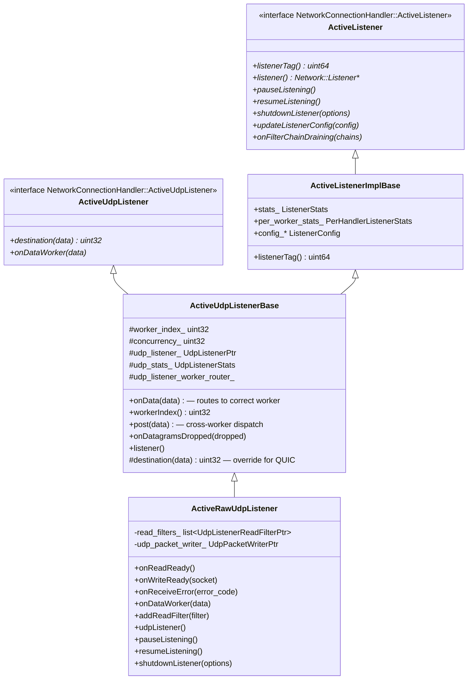
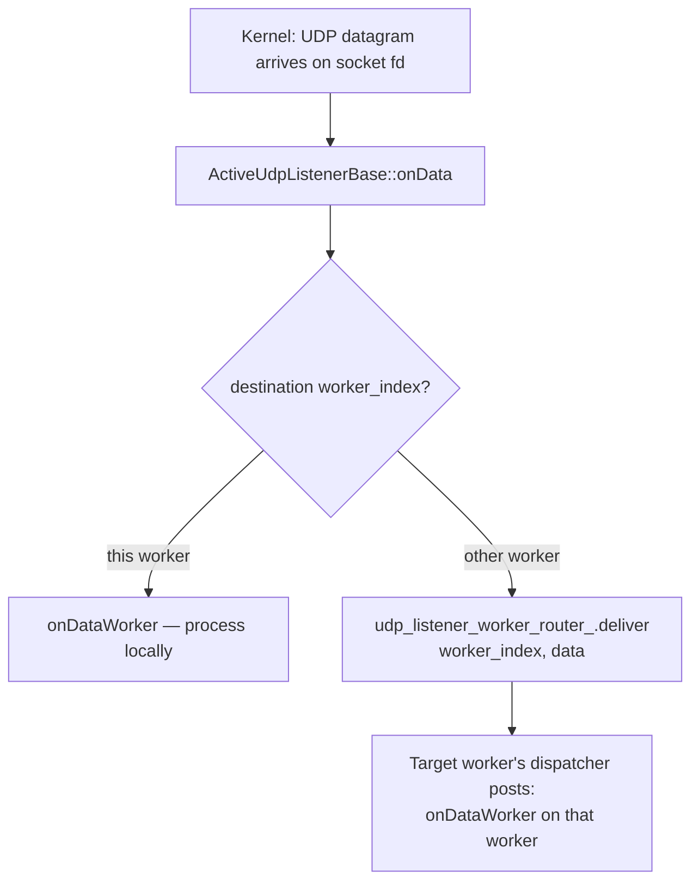

# Active Listeners — `active_listener_base.h` / `active_udp_listener.h`

**Files:**
- `source/server/active_listener_base.h` — `ActiveListenerImplBase` (shared base for all active listeners)
- `source/server/active_udp_listener.h` — `ActiveUdpListenerBase`, `ActiveRawUdpListener`

Active listeners are the per-worker wrappers around a bound socket. Each `WorkerImpl`
owns a `ConnectionHandlerImpl` which holds one `ActiveListener` per configured listener.
TCP and UDP listeners share a common base but diverge significantly in their data paths.

---

## Class Hierarchy



---

## `ActiveListenerImplBase` — Shared Base

Constructed once per `(worker, listener)` pair. Initializes stats directly from the
listener's scope using pool macros — no heap allocation per stat lookup on the hot path.

```cpp
ActiveListenerImplBase(Network::ConnectionHandler& parent, Network::ListenerConfig* config)
    : stats_({ ALL_LISTENER_STATS(
          POOL_COUNTER(config->listenerScope()),
          POOL_GAUGE(config->listenerScope()),
          POOL_HISTOGRAM(config->listenerScope())) }),
      per_worker_stats_({ ALL_PER_HANDLER_LISTENER_STATS(
          POOL_COUNTER_PREFIX(config->listenerScope(), parent.statPrefix()),
          POOL_GAUGE_PREFIX(config->listenerScope(), parent.statPrefix())) }),
      config_(config) {}
```

**`ListenerStats`** — aggregate stats across all workers for this listener.
**`PerHandlerListenerStats`** — per-worker stats, prefixed with the worker's
`statPrefix()` (e.g. `worker_0`). Used to track per-worker connection counts and
identify uneven load distribution.

---

## UDP Data Path — Worker Routing

UDP is fundamentally different from TCP: a single bound socket receives all datagrams
regardless of which worker "owns" it. `ActiveUdpListenerBase` handles the routing:



`destination(data)` is a virtual method — the base returns `worker_index_` (current
worker) by default. QUIC listeners override it to hash the connection ID to a stable
worker index, ensuring all packets for a QUIC connection land on the same worker.

`post(data)` serializes and dispatches to another worker's event loop. This is the
only case where UDP data crosses worker thread boundaries.

---

## `ActiveRawUdpListener` — Non-QUIC UDP

For plain UDP (DNS, DTLS, custom UDP filters). Owns:
- `read_filters_` — a list of `UdpListenerReadFilter` instances (analogous to TCP's
  network filter chain)
- `udp_packet_writer_` — used by filters to send UDP responses back downstream

### Key callbacks

| Callback | Triggered by | Action |
|---|---|---|
| `onReadReady()` | libevent: socket readable | Read up to `MAX_NUM_PACKETS_PER_EVENT_LOOP` datagrams; call `onData()` for each |
| `onWriteReady(socket)` | libevent: socket writable | Flush pending writes via `udp_packet_writer_` |
| `onReceiveError(error_code)` | `recvmsg` error | Increment error counters; notify filters |
| `onDataWorker(data)` | Worker routing | Pass to `read_filters_` chain |

### `shutdownListener()`

Clears `read_filters_` **before** resetting `udp_listener_` — ensures filters cannot
call back into the listener after it is destroyed. Order matters because filters hold
a reference to the UDP listener for sending responses.

### `numPacketsExpectedPerEventLoop()`

Returns `Network::MAX_NUM_PACKETS_PER_EVENT_LOOP`. This hint tells the UDP listener
how many packets to batch-read per event loop iteration, amortizing syscall overhead.

---

## Per-Handler Stats (`PerHandlerListenerStats`)

Each worker has its own copy of per-handler stats under the prefix
`listener.<addr>.<worker_name>.`:

| Stat | Meaning |
|---|---|
| `downstream_cx_total` | Connections/sessions accepted by this worker |
| `downstream_cx_active` | Current active connections on this worker |

These are used to detect and alert on uneven connection distribution across workers
(e.g., when `reuse_port` is not working correctly on the OS).

---

## `UdpListenerStats`

Single counter, defined via the `ALL_UDP_LISTENER_STATS` macro:

| Stat | Meaning |
|---|---|
| `downstream_rx_datagram_dropped` | Datagrams dropped by the kernel before `recvmsg` (kernel buffer overflow) |

Incremented via `onDatagramsDropped(dropped)` which is called when `recvmsg` returns
`MSG_TRUNC` or when the socket's receive buffer reports drops via `SO_RXQ_OVFL`.
