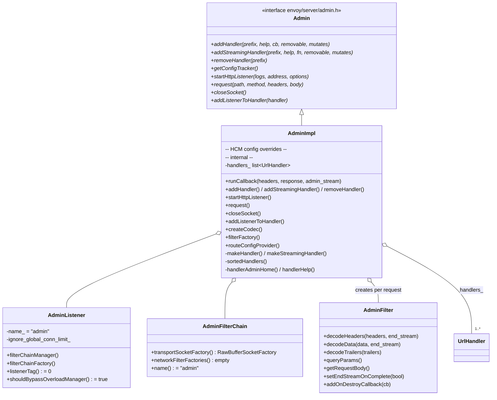
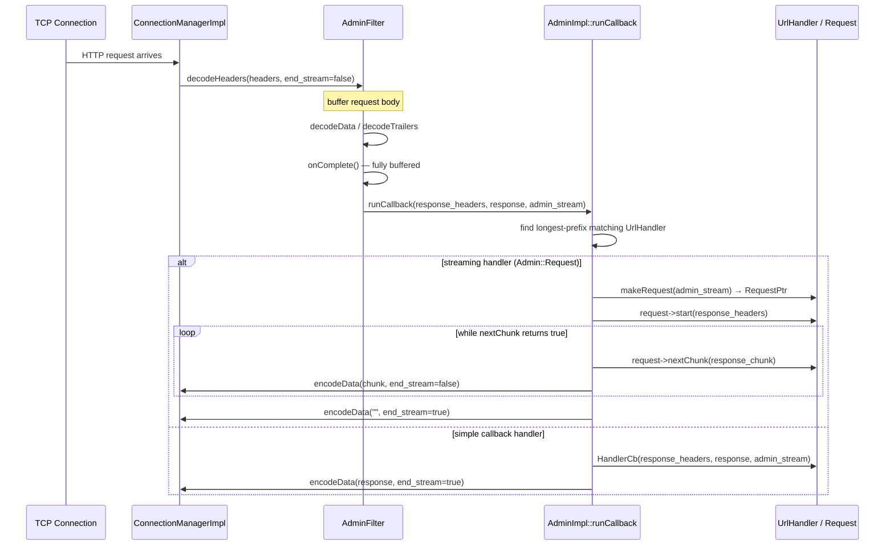
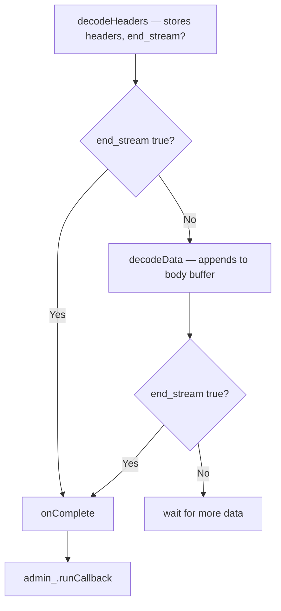

# Admin Server — `admin.h`

**File:** `source/server/admin/admin.h`

`AdminImpl` is Envoy's built-in HTTP management server (default port 9901). It is a
fully self-contained HTTP/1.1 server that implements `Http::ConnectionManagerConfig`,
`Network::FilterChainManager`, and `Network::FilterChainFactory` all in one class — it
reuses the same HCM (`ConnectionManagerImpl`) that serves production traffic, wired to
a stripped-down no-op route config and a `NullOverloadManager`.

---

## Class Overview



---

## Request Dispatch Architecture



### Two Handler Types

| Type | Registration | Response model | Use case |
|---|---|---|---|
| `HandlerCb` (simple) | `addHandler()` | Single buffer — must fit in memory | Most endpoints (`/clusters`, `/listeners`, etc.) |
| `GenRequestFn` (streaming) | `addStreamingHandler()` | `nextChunk()` called repeatedly — 2MB default chunks | `/stats` (can be very large) |

---

## Registered Handlers

All handlers are registered in the `AdminImpl` constructor:

| URL prefix | Handler class | Mutates state | Description |
|---|---|---|---|
| `/` | `AdminImpl` | No | Home page — lists all handlers |
| `/clusters` | `ClustersHandler` | No | Upstream cluster health/status |
| `/config_dump` | `ConfigDumpHandler` | No | xDS config snapshot |
| `/init_dump` | `InitDumpHandler` | No | Init manager target state |
| `/listeners` | `ListenersHandler` | No | Listener status |
| `/stats` | `StatsHandler` | No | Stats (streaming) |
| `/stats/prometheus` | `StatsHandler` | No | Prometheus-format stats |
| `/stats/recentlookups` | `StatsHandler` | No | Symbol table lookup diagnostics |
| `/stats/recentlookups/clear` | `StatsHandler` | **Yes** | Reset lookup counter |
| `/stats/recentlookups/disable` | `StatsHandler` | **Yes** | Stop tracking lookups |
| `/stats/recentlookups/enable` | `StatsHandler` | **Yes** | Start tracking lookups |
| `/runtime` | `RuntimeHandler` | No | Current runtime values |
| `/runtime_modify` | `RuntimeHandler` | **Yes** | Modify runtime value |
| `/logging` | `LogsHandler` | **Yes** | Change log levels |
| `/memory` | `ServerInfoHandler` | No | jemalloc stats |
| `/server_info` | `ServerInfoHandler` | No | Build/uptime/state info |
| `/ready` | `ServerInfoHandler` | No | Health check endpoint |
| `/drain_listeners` | `ServerCmdHandler` | **Yes** | Trigger listener drain |
| `/quitquitquit` | `ServerCmdHandler` | **Yes** | Shutdown Envoy |
| `/reset_counters` | `StatsHandler` | **Yes** | Zero all counters |
| `/heap_profiler` | `ProfilingHandler` | **Yes** | jemalloc heap profiling |
| `/cpuprofiler` | `ProfilingHandler` | **Yes** | CPU profiling |
| `/contention` | `StatsHandler` | No | Mutex contention stats |

Handlers returning `mutates_server_state = true` are only accessible via **HTTP POST**.
GET requests to mutating endpoints return `405 Method Not Allowed`.

---

## `AdminImpl` as `Http::ConnectionManagerConfig`

`AdminImpl` fully implements the `ConnectionManagerConfig` interface to reuse
`ConnectionManagerImpl` for HTTP parsing, header processing, and filter dispatch.
Key overrides from the production HCM config:

| Override | Admin value | Reason |
|---|---|---|
| `tracer()` | `nullptr` | No tracing on admin |
| `routeConfigProvider()` | `NullRouteConfigProvider` | Admin has no routing; `AdminFilter` is the terminal filter |
| `isRoutable()` | `false` | Suppresses route lookup entirely |
| `drainTimeout()` | 100ms | Fast drain for admin connections |
| `generateRequestId()` | `false` | No request ID headers |
| `idleTimeout()` | configured | Prevent stale admin connections |
| `xffNumTrustedHops()` | 0 | Treat all addresses as untrusted |
| `forwardClientCert()` | `Sanitize` | Strip client cert headers |
| `shouldBypassOverloadManager()` | `true` (AdminListener) | Admin never gets overload-rejected |
| `nullOverloadManager_` | `NullOverloadManager` | Dummy overload manager for admin |

---

## `AdminFilter` — Terminal HTTP Filter

`AdminFilter` is a `PassThroughFilter` registered as the **sole HTTP filter** in the
admin filter chain. It accumulates the full request body before dispatching:



`onComplete()` dispatches to `admin_.runCallback()`. For streaming responses, the filter
stays alive while `nextChunk()` is called repeatedly on the worker's event loop.
`addOnDestroyCallback(cb)` lets streaming request objects register for cleanup
notification when the filter is destroyed (e.g., client disconnected mid-stream).

---

## `AdminListener` — Built-in Listener Config

`AdminListener` implements `Network::ListenerConfig` inline inside `AdminImpl`. Key
properties that differ from regular listeners:

| Property | Value | Reason |
|---|---|---|
| `shouldBypassOverloadManager()` | `true` | Admin must be reachable under overload |
| `ignoreGlobalConnLimit()` | configurable | Can ignore global connection limit |
| `listenerTag()` | 0 | Special-cased in ConnectionHandler |
| `udpListenerConfig()` | empty | TCP only |
| `connectionBalancer()` | `NopConnectionBalancerImpl` | No cross-worker balancing |

---

## `NullRouteConfigProvider` / `NullScopedRouteConfigProvider`

Both return empty configs. Since `isRoutable() = false`, the HCM never calls
`routeConfigProvider()` on the hot path — these are effectively dead code that
satisfies the `ConnectionManagerConfig` interface.

---

## `AdminFilterChain` — Bare-Metal Filter Chain

```cpp
class AdminFilterChain : public Network::FilterChain {
    // transportSocketFactory: RawBufferSocketFactory — no TLS
    // networkFilterFactories: empty — HCM is wired directly
    // name: "admin"
};
```

Plain TCP, no TLS, no network filters. The HCM is wired in
`createNetworkFilterChain()` by calling `connection.addReadFilter(new HttpConnectionManagerImpl(...))`.

---

## `ConfigTrackerImpl`

Maintains a `CbsMap` of `(key → Cb)` pairs. Each subsystem (clusters, listeners,
routes, etc.) registers a callback that, when invoked, returns a snapshot of its
current xDS config as a `ProtobufMessage`. Entries self-unregister on destruction
via the RAII `EntryOwnerImpl`.

`ConfigDumpHandler` calls `getCallbacksMap()` and invokes each callback to build
the full `/config_dump` response.
