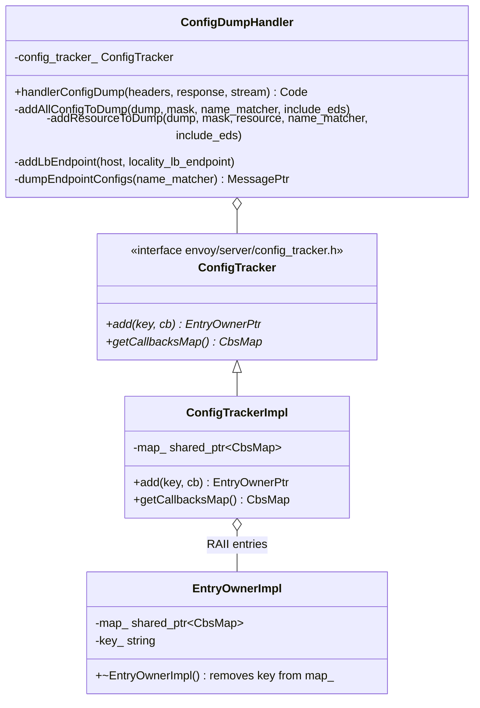
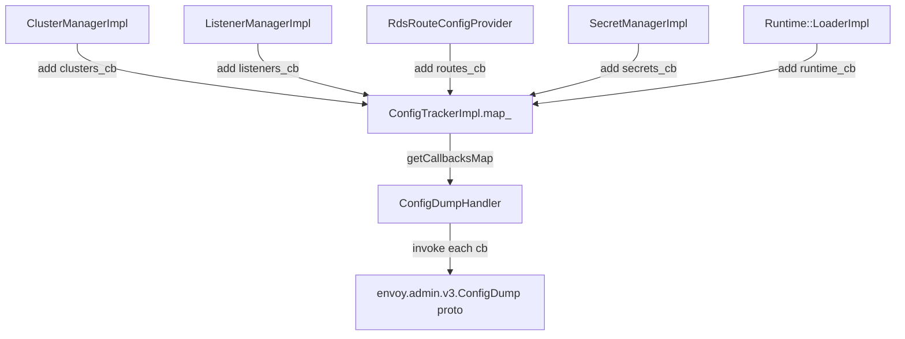
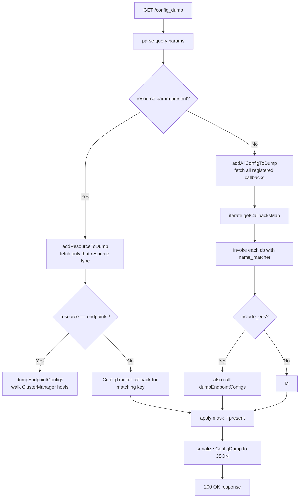

# Config Dump Handler — `config_dump_handler.h` / `config_tracker_impl.h`

**Files:**
- `source/server/admin/config_dump_handler.h` — `ConfigDumpHandler`
- `source/server/admin/config_tracker_impl.h` — `ConfigTrackerImpl`

`ConfigDumpHandler` serves `/config_dump` — the most useful debugging endpoint in
Envoy. It returns a full snapshot of the currently active xDS configuration (clusters,
listeners, routes, endpoints, secrets, runtime) serialized as a proto JSON.

---

## Class Overview



---

## `ConfigTrackerImpl` — Registration Hub

Each subsystem registers a callback that, when invoked, returns a proto snapshot
of its current xDS state:

```cpp
EntryOwnerPtr add(const std::string& key, Cb cb);
// Cb = std::function<ProtobufTypes::MessagePtr(const Matchers::StringMatcher&)>
```



`EntryOwnerImpl` is RAII — when a subsystem is destroyed (e.g., cluster removed),
its `EntryOwnerPtr` goes out of scope and the key is automatically removed from the
shared `CbsMap`. This prevents dangling callbacks.

---

## `/config_dump` Request Handling

### URL Parameters

| Parameter | Type | Description |
|---|---|---|
| `resource` | string | Filter to one resource type: `clusters`, `listeners`, `routes`, `secrets`, `runtime`, `endpoints` |
| `mask` | FieldMask string | Proto field mask — strip unneeded fields from response |
| `name_regex` | RE2 string | Filter resources by name |
| `include_eds` | (present) | Include endpoint config (EDS) — can be large; excluded by default |

### Dispatch Flow



### `addResourceToDump` vs `addAllConfigToDump`

- `addAllConfigToDump` — iterates all registered keys, invokes each callback, appends
  each result to `ConfigDump.configs`. On error (e.g., mask parse failure), returns
  a `(Code, message)` pair and stops.
- `addResourceToDump` — invokes only the single callback matching `resource=<key>`.
  If the key is `endpoints`, calls `dumpEndpointConfigs()` instead (endpoints are
  not registered via `ConfigTracker`).

---

## Endpoint Config Dump

Endpoints are handled specially — they are not registered in `ConfigTracker` because
they change too frequently and are computed on-demand:

```cpp
ProtobufTypes::MessagePtr dumpEndpointConfigs(
    const Matchers::StringMatcher& name_matcher) const;
```

Walks `server_.clusterManager()` to collect all host sets, then for each host:

```cpp
void addLbEndpoint(
    const Upstream::HostSharedPtr& host,
    envoy::config::endpoint::v3::LocalityLbEndpoints& locality_lb_endpoint) const;
```

Populates:
- `address` (IP:port)
- `health_status` (HEALTHY / UNHEALTHY / DRAINING / etc.)
- `metadata` (endpoint-level metadata)
- `load_balancing_weight`

The result is an `envoy.admin.v3.EndpointsConfigDump` proto appended to the
`ConfigDump`.

---

## Proto Field Mask (`mask` parameter)

When `mask=<FieldMask>` is present, `ConfigDumpHandler` applies
`FieldMaskUtil::TrimMessage()` to each resource proto before serialization. This
strips fields not listed in the mask, reducing response size.

Example: `GET /config_dump?resource=clusters&mask=static_clusters.cluster.name`
returns only cluster names, not the full cluster config.

---

## Registered Config Tracker Keys

| Key | Registered by | Proto type |
|---|---|---|
| `clusters` | `ClusterManagerImpl` | `envoy.admin.v3.ClustersConfigDump` |
| `listeners` | `ListenerManagerImpl` | `envoy.admin.v3.ListenersConfigDump` |
| `routes` | `RdsRouteConfigProviderManager` | `envoy.admin.v3.RoutesConfigDump` |
| `secrets` | `SecretManagerImpl` | `envoy.admin.v3.SecretsConfigDump` |
| `runtime` | `Runtime::LoaderImpl` | `envoy.admin.v3.RuntimeConfigDump` |
| `scoped_routes` | `ScopedRdsConfigProviderManager` | `envoy.admin.v3.ScopedRoutesConfigDump` |
| `endpoints` | _(special — via dumpEndpointConfigs)_ | `envoy.admin.v3.EndpointsConfigDump` |
