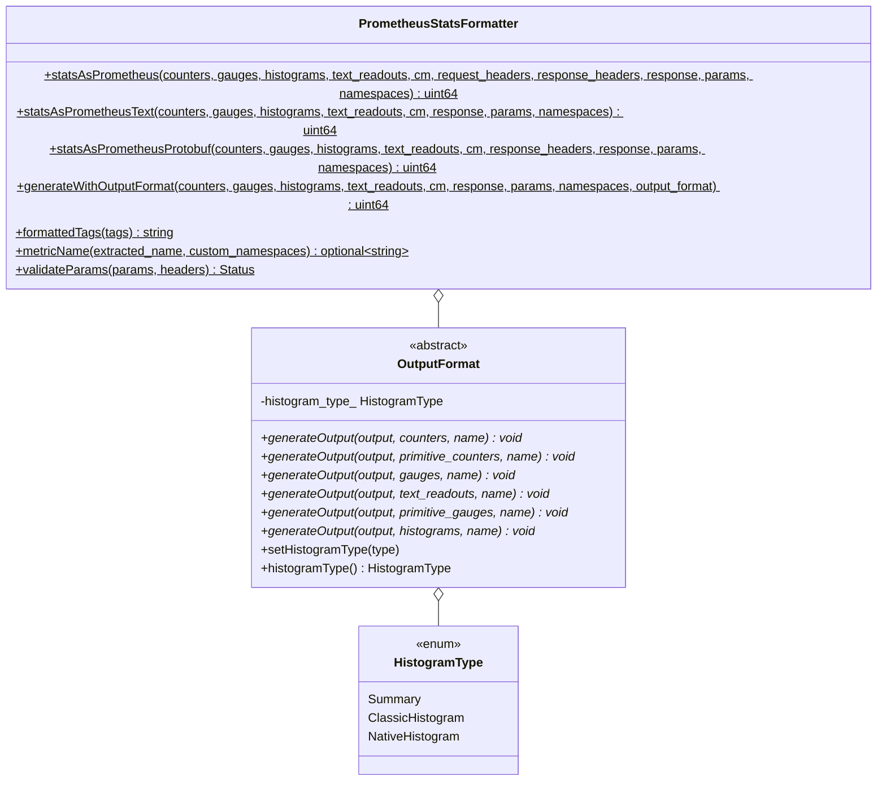
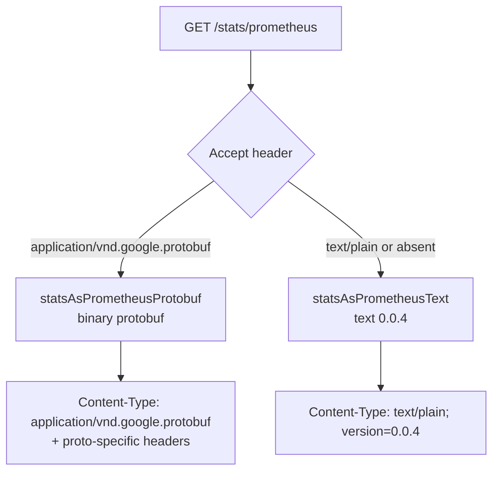
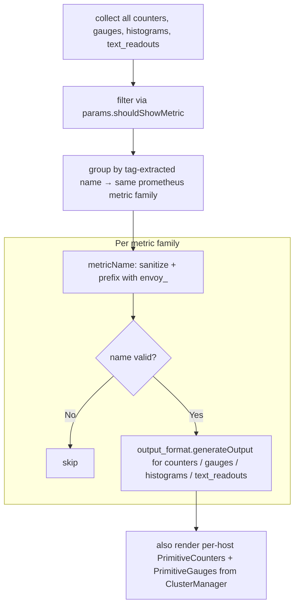

# Prometheus Stats Formatter — `prometheus_stats.h`

**File:** `source/server/admin/prometheus_stats.h`

`PrometheusStatsFormatter` converts Envoy's internal stats (counters, gauges,
histograms, text readouts, per-host primitives) into Prometheus exposition format.
Supports both **text** (`text/plain; version=0.0.4`) and **protobuf**
(`application/vnd.google.protobuf`) output, and three histogram representations.

---

## Class Overview



---

## Output Format Selection

`statsAsPrometheus()` auto-detects format from the `Accept` header:



Both paths call `generateWithOutputFormat()` with a type-specific `OutputFormat`
implementation. The return value is the total count of metric families emitted.

---

## `generateWithOutputFormat()` — Core Rendering Loop

Groups stats by **tag-extracted name** before rendering. Two stats with the same
base name but different tag values (e.g., `cluster.foo.upstream_cx_total` and
`cluster.bar.upstream_cx_total`) are grouped under the same metric family
`envoy_cluster_upstream_cx_total` with `cluster_name="foo"` / `cluster_name="bar"` labels.



---

## `metricName()` — Name Sanitization

```cpp
static absl::optional<std::string>
    metricName(const std::string& extracted_name,
               const Stats::CustomStatNamespaces& custom_namespaces);
```

Applies these transformations:

1. **Custom namespace prefix stripping** — if `extracted_name` has a registered
   custom namespace prefix (e.g., `myapp.`), the prefix is stripped and the
   remainder is used as-is (no `envoy_` prefix added).
2. **`envoy_` prefix** — default names are prefixed: `cluster.upstream_cx_total`
   → `envoy_cluster_upstream_cx_total`.
3. **Character sanitization** — any character not in `[a-zA-Z0-9_]` is replaced
   with `_` per the [Prometheus data model](https://prometheus.io/docs/concepts/data_model/).
4. **Validity check** — names starting with a digit or containing consecutive `__`
   (reserved) return `nullopt` → stat is silently skipped.

---

## `formattedTags()` — Label Rendering

```cpp
static std::string formattedTags(const std::vector<Stats::Tag>& tags);
// Returns: cluster_name="foo",response_code="200"
```

Tag names are sanitized with the same rules as metric names. Tag values are
quoted and escaped. The output is used as the `{labels}` portion of:

```
envoy_cluster_upstream_rq_total{cluster_name="foo",response_code="200"} 42
```

---

## Histogram Representations

`histogram_type_` on `OutputFormat` controls which representation is emitted:

| Type | Proto histogram field | Description |
|---|---|---|
| `Summary` | `quantiles` | Emits `_count`, `_sum`, quantile gauges (p50, p75, p90, p95, p99, p99.9) |
| `ClassicHistogram` | `buckets` | Emits `_count`, `_sum`, and `_bucket{le="<upper>"}` cumulative counts |
| `NativeHistogram` | native histogram | Prometheus native histogram format (exponential buckets) |

Default is `Summary`. Set via `histogram_buckets` query param (see `StatsParams`).

### Summary example output

```
# TYPE envoy_cluster_upstream_rq_time summary
envoy_cluster_upstream_rq_time{cluster_name="foo",quantile="0.5"}  12.5
envoy_cluster_upstream_rq_time{cluster_name="foo",quantile="0.9"}  45.0
envoy_cluster_upstream_rq_time{cluster_name="foo",quantile="0.99"} 98.0
envoy_cluster_upstream_rq_time_sum{cluster_name="foo"}             15043.0
envoy_cluster_upstream_rq_time_count{cluster_name="foo"}           301
```

### Classic histogram example output

```
# TYPE envoy_cluster_upstream_rq_time histogram
envoy_cluster_upstream_rq_time_bucket{cluster_name="foo",le="0.5"}  10
envoy_cluster_upstream_rq_time_bucket{cluster_name="foo",le="1"}    20
envoy_cluster_upstream_rq_time_bucket{cluster_name="foo",le="+Inf"} 301
envoy_cluster_upstream_rq_time_sum{cluster_name="foo"}              15043.0
envoy_cluster_upstream_rq_time_count{cluster_name="foo"}            301
```

---

## `validateParams()`

Validates the combination of `StatsParams` and `Accept` header is coherent before
rendering:

- `format=prometheus` must not be combined with `type=TextReadouts` (unless
  `prometheus_text_readouts=true` is set)
- Native histogram bucket count limit must be positive if set
- Returns `absl::OkStatus()` on success; error message is sent as HTTP `400` response

---

## Per-Host Primitive Stats

After the main stats pass, `generateWithOutputFormat` also renders per-host
primitive counters and gauges from `ClusterManager::hostCounters()` and
`hostGauges()`. These are the stats attached to individual upstream endpoints
(e.g., per-host connection counts, request counts) rather than cluster-aggregated
stats. They use the same grouping and `envoy_` prefix logic.
