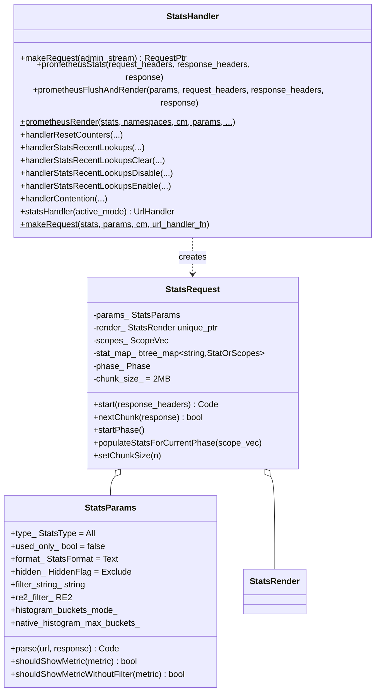
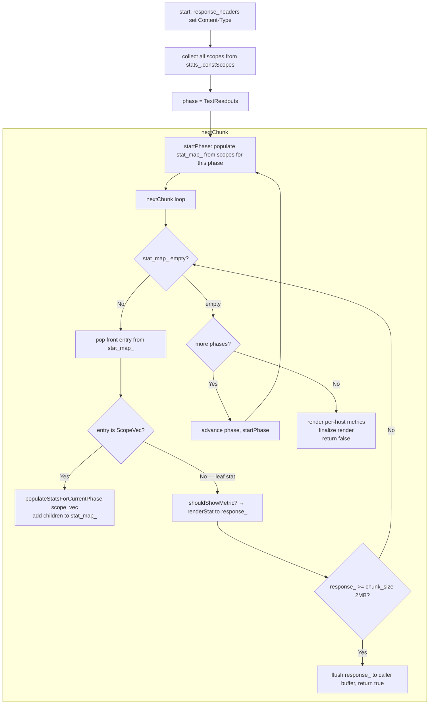

# Stats Handler — `stats_handler.h` / `stats_request.h` / `stats_params.h`

**Files:**
- `source/server/admin/stats_handler.h` — `StatsHandler` (entry point, Prometheus bridge)
- `source/server/admin/stats_request.h` — `StatsRequest` (chunked streaming state machine)
- `source/server/admin/stats_params.h` — `StatsParams` (parsed query parameters)

The stats subsystem serves `/stats` and `/stats/prometheus`. It streams responses
in 2MB chunks to avoid buffering the entire stat set (which can be several MB in
large deployments) before the first byte reaches the client.

---

## Class Overview



---

## Query Parameters (`StatsParams`)

| Parameter | Values | Default | Description |
|---|---|---|---|
| `type` | `Counters`, `Gauges`, `Histograms`, `TextReadouts`, `All` | `All` | Filter by stat type |
| `usedonly` | (present = true) | false | Exclude stats with value 0 and never written |
| `filter` | RE2 regex string | none | Name filter (partial match) |
| `format` | `text`, `json`, `prometheus`, `html`, `active-html` | `text` | Output format |
| `hidden` | `include`, `showonly`, `exclude` | `exclude` | Hidden stat visibility |
| `histogram_buckets` | `cumulative`, `disjoint`, `detailed`, `summary` | (unset) | Histogram rendering mode |
| `pretty` | (present = true) | false | Pretty-print JSON |

`shouldShowMetric<StatType>(metric)` is a template that applies all filters in one
call — used by both `StatsRequest` and `PrometheusStatsFormatter` to avoid
duplicating filter logic.

---

## Streaming Architecture (`StatsRequest`)

`StatsRequest` implements `Admin::Request` — the interface for chunked admin responses.



### Three-Phase Traversal

All scopes are visited 3 times — once per phase. This preserves the ordering
expected by callers and test snapshots (text readouts first, then
counters+gauges interleaved alphabetically, then histograms):

| Phase | Stats collected |
|---|---|
| `TextReadouts` | `Stats::TextReadout` only |
| `CountersAndGauges` | `Stats::Counter` + `Stats::Gauge` co-mingled alphabetically |
| `Histograms` | `Stats::ParentHistogram` only |

### `stat_map_` — Lazy Sorted Iteration

`stat_map_` is an `absl::btree_map<string, StatOrScopes>`. The key insight:
- At `start()`, only **scopes** are added (not individual stats)
- When a `ScopeVec` entry is popped, its children are lazily expanded into the map
- Leaf stats (`Counter`, `Gauge`, etc.) are rendered immediately when popped
- This avoids allocating vectors for all stats upfront while preserving alphabetical order

```
stat_map_ after start():
  ""          → [ScopeVec: root scope, cluster.foo scope, ...]
  "cluster.foo" → [ScopeVec: cluster.foo's child scopes]

After first pop (root scope expanded):
  "cluster.foo.upstream_cx_total" → CounterSharedPtr
  "cluster.foo.upstream_rq_total" → CounterSharedPtr
  "listener.0.0.0.0_9901"        → [ScopeVec]
  ...
```

`DefaultChunkSize = 2 * 1000 * 1000` bytes (2MB). Configurable via `setChunkSize()`
in tests.

---

## Format Types

| `StatsFormat` | Content-Type | Description |
|---|---|---|
| `Text` | `text/plain` | `<name>: <value>` per line |
| `Json` | `application/json` | `{"stats": [...]}` array |
| `Prometheus` | `text/plain; version=0.0.4` | Prometheus text exposition format |
| `Html` | `text/html` | Rendered HTML table with filter form |
| `ActiveHtml` | `text/html` | HTML, force `usedonly=true`, shows most-active stats |

`StatsRender` is a virtual base (`StatsTextRender`, `StatsJsonRender`,
`StatsHtmlRender`). `StatsRequest` creates the right one based on `params_.format_`.

---

## `/stats/prometheus` Path

```mermaid
flowchart TD
    A[GET /stats/prometheus] --> B[StatsHandler::handlerPrometheusStats]
    B --> C[prometheusStats: parse params, detect flush needed]
    C --> D{flushOnAdmin? AND flush_needed?}
    D -->|Yes| E[server_.flushStats() — latch all counters]
    D -->|No| F
    E --> F[prometheusFlushAndRender]
    F --> G[PrometheusStatsFormatter::statsAsPrometheus]
    G --> H{Accept: application/vnd.google.protobuf?}
    H -->|Yes| I[statsAsPrometheusProtobuf\nProtobuf binary format]
    H -->|No| J[statsAsPrometheusText\ntext/plain 0.0.4 format]
```

The Prometheus path bypasses `StatsRequest` — it uses `PrometheusStatsFormatter`
directly (a single-pass render, not chunked). See `prometheus_stats.md` for
format details.

---

## Miscellaneous Handlers

| Method | URL | Description |
|---|---|---|
| `handlerResetCounters` | `POST /reset_counters` | Calls `stats_store_.resetCounters()` — zeroes all latch values |
| `handlerContention` | `GET /contention` | Dumps mutex contention data from `MutexTracer` (if enabled) |
| `handlerStatsRecentLookups` | `GET /stats/recentlookups` | Shows symbol table lookup frequency table |
| `handlerStatsRecentLookupsClear` | `POST /stats/recentlookups/clear` | Resets lookup frequency table |
| `handlerStatsRecentLookupsDisable` | `POST /stats/recentlookups/disable` | Stops recording lookups |
| `handlerStatsRecentLookupsEnable` | `POST /stats/recentlookups/enable` | Starts recording lookups (costly — use briefly) |

`recentlookups` tracks which stat names are looked up most frequently, helping
identify hot stats that should be cached via `StatNamePool`.
