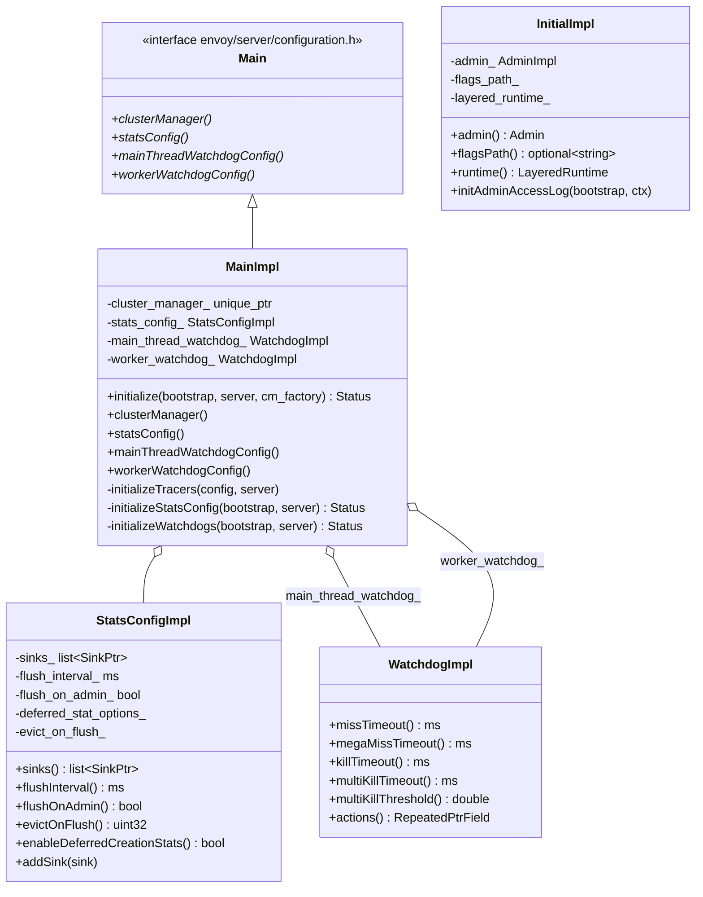
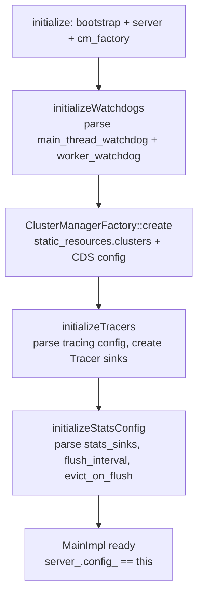

# Server Configuration — `configuration_impl.h`

**File:** `source/server/configuration_impl.h`

Implements the server-side parsing of the bootstrap proto into live components.
The key class is `MainImpl`, which is the bridge between a
`envoy::config::bootstrap::v3::Bootstrap` proto and the running server subsystems
(ClusterManager, stats sinks, tracing, watchdogs). Also defines `InitialImpl` (pre-server
admin/runtime config) and `StatsConfigImpl` (stats flush behavior).

---

## Class Overview



---

## `MainImpl::initialize()` — Bootstrap Parsing Sequence

Called from `InstanceBase::initializeOrThrow()` after the server's core infrastructure
(API, TLS, dispatcher) is ready.



### `initializeTracers()`

Parses `bootstrap.tracing` and creates the configured `Tracing::Tracer` implementation
(Zipkin, Jaeger, OpenTelemetry, etc.) via `Config::Utility::getAndCheckFactory`.
The tracer is installed into `server.httpContext()` as the default tracing backend
for all HCM instances.

### `initializeStatsConfig()`

- Instantiates each configured `stats_sink` via `StatsSinkFactory` registry lookup.
- Sets `flush_interval_` from `bootstrap.stats_flush_interval` (default: 5s).
- Sets `flush_on_admin_` — if true, stats are also flushed when `/stats` admin endpoint is called.
- Sets `evict_on_flush_` — number of zero-valued stats to evict from the symbol table on each flush.
- Handles `deferred_stat_options_` — defers stats allocation until first use.

### `initializeWatchdogs()`

Parses `bootstrap.watchdog` (or `bootstrap.watchdogs` for separate main/worker configs)
into `WatchdogImpl` objects. Each `WatchdogImpl` stores the 4 timeouts plus the repeated
`WatchdogAction` extensions that `GuardDogImpl` invokes.

---

## `StatsConfigImpl`

Holds the runtime stats configuration consumed by `InstanceBase::flushStats()`:

| Field | Source | Default |
|---|---|---|
| `sinks_` | `bootstrap.stats_sinks[]` — one per configured sink type | empty |
| `flush_interval_` | `bootstrap.stats_flush_interval` | 5 seconds |
| `flush_on_admin_` | `bootstrap.stats_flush_on_admin` | false |
| `evict_on_flush_` | `bootstrap.stats_config.max_obj_name_length` (reused field) | 0 |
| `deferred_stat_options_` | `bootstrap.deferred_stat_options` | disabled |

`addSink()` is called by extensions (e.g., Admin) to inject additional sinks after
the bootstrap is parsed.

---

## `WatchdogImpl`

Concrete implementation of `Server::Configuration::Watchdog`. Parsed from the
`envoy.config.bootstrap.v3.Watchdog` proto:

| Field | Default | Description |
|---|---|---|
| `miss_timeout_` | 20s | First alert threshold |
| `megamiss_timeout_` | 1 min | Second alert threshold |
| `kill_timeout_` | 0 (disabled) | Hard kill threshold |
| `multikill_timeout_` | 0 (disabled) | Multi-thread kill threshold |
| `multikill_threshold_` | 0.0 | Fraction of threads required for multi-kill |
| `actions_` | [] | Custom `WatchdogAction` extension configs |

Two instances exist per server: `main_thread_watchdog_` (for the main dispatcher
thread) and `worker_watchdog_` (shared configuration for all worker threads).

---

## `InitialImpl` — Pre-Server Bootstrap Parsing

Used before `MainImpl` — parsed from the bootstrap proto during the very first phase
of `InstanceBase::initialize()` to extract admin and runtime config:

| Method | Returns | Source |
|---|---|---|
| `admin()` | `AdminImpl&` | `bootstrap.admin` — address, profile_path, access logs |
| `flagsPath()` | `optional<string>` | `bootstrap.flags_path` — path to server flags file |
| `runtime()` | `LayeredRuntime&` | `bootstrap.layered_runtime` — RTDS + disk + admin layers |

`initAdminAccessLog()` is called separately after `FactoryContext` is available to
instantiate the admin's access log sinks (requires server infrastructure).

---

## `FilterChainUtility` — Network Filter Chain Builder

Static helpers for instantiating filter chains from factory lists. Called per new
connection (not at boot time).

| Method | Called by | Creates |
|---|---|---|
| `buildFilterChain(filter_manager, factories)` | `ConnectionHandlerImpl` on TCP accept | Network filter chain (L4) |
| `buildFilterChain(listener_filter_manager, factories)` | Listener filter processing | Listener filters (TLS inspector, etc.) |
| `buildUdpFilterChain(udp_manager, callbacks, factories)` | `ActiveRawUdpListener` | UDP read filters |
| `buildQuicFilterChain(quic_manager, factories)` | QUIC listener | QUIC listener filters |

All variants return early if a filter calls `close()` during its `onNewConnection()` /
`onAccept()` callback — the remaining factories are not instantiated.

---

## `StatsSinkFactory`

Extension point for custom stats export backends:

```cpp
class StatsSinkFactory : public Config::TypedFactory {
    virtual absl::StatusOr<Stats::SinkPtr>
        createStatsSink(const Protobuf::Message& config,
                        ServerFactoryContext& server) PURE;
    std::string category() const override { return "envoy.stats_sinks"; }
};
```

Registered sinks: `envoy.stat_sinks.statsd`, `envoy.stat_sinks.dog_statsd`,
`envoy.stat_sinks.metrics_service`, `envoy.stat_sinks.open_telemetry_service`,
`envoy.stat_sinks.hystrix`.
