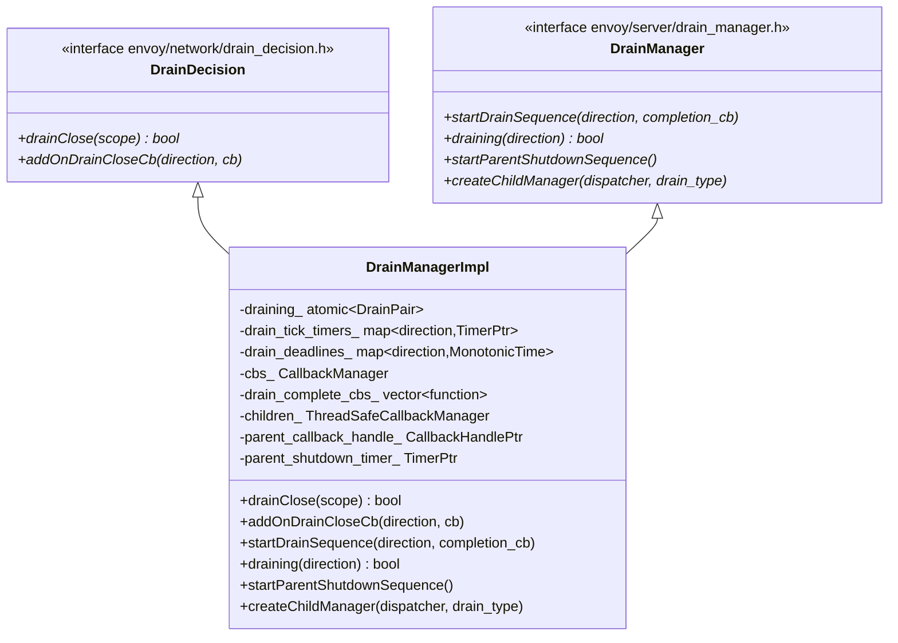
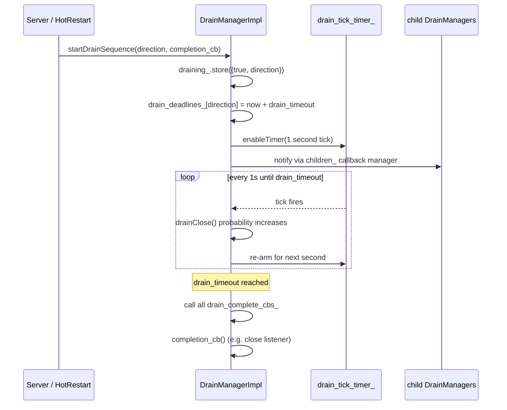
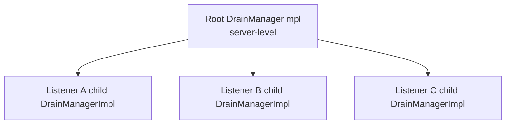

# Drain Manager — `drain_manager_impl.h`

**File:** `source/server/drain_manager_impl.h`

`DrainManagerImpl` coordinates graceful shutdown of listeners and connections. It is used
both by the server-level drain sequence (SIGTERM / hot restart) and by individual listener
drain operations. It implements probabilistic `drainClose()` — connections become more
likely to be closed the further into the drain window we are.

---

## Class Overview



---

## Drain Directions

`Network::DrainDirection` enum controls what scope is being drained:

| Value | Meaning |
|---|---|
| `None` | Not draining |
| `InboundOnly` | Only inbound connections (e.g., hot restart — stop accepting new downstream conns) |
| `All` | Both inbound and outbound (full shutdown) |

`draining(direction)` returns `true` if the current drain direction is **≥** the
requested direction (i.e., `All` satisfies both `InboundOnly` and `All` checks).

---

## `startDrainSequence()` — How Drain Works



### Probabilistic `drainClose()`

`drainClose(scope)` is called by `ConnectionManagerImpl` on every response to decide
whether to append `Connection: close` (H1) or send GOAWAY (H2/H3):

```
elapsed   = now - drain_start_time
deadline  = drain_deadline
fraction  = elapsed / deadline  (clamped to [0, 1])

DRAIN_GRADUAL: return random.bernoulli(fraction)  — probability increases linearly
DRAIN_CLOSE:   return true immediately (all connections close)
```

`drain_type_` (from `Listener.DrainType` proto enum):

| Value | Behavior |
|---|---|
| `DEFAULT` (gradual) | Probabilistic — `P(close) = elapsed/deadline` |
| `MODIFY_ONLY` | Only modifies headers; does not independently close |

---

## Parent–Child Manager Tree

`DrainManagerImpl` supports a tree of managers. The server creates one root manager;
each listener creates a **child** manager via `createChildManager()`.



When the root's `startDrainSequence()` fires, it propagates to all children via
`children_` (`ThreadSafeCallbackManager`). Each child then runs its own drain tick
timer and tracks its own `drain_deadlines_`.

Children register with the parent via `parent_callback_handle_` (a `CallbackHandlePtr`).
When a child is destroyed (listener removed), the handle is released and the child
automatically unregisters.

---

## `startParentShutdownSequence()`

Called by `HotRestartingChild` after the parent has been asked to drain. This starts
a **15-minute countdown timer** (`parent_shutdown_timer_`). If the parent process
has not exited by then, the child sends a forceful `sendParentTerminateRequest()`.

This prevents a permanently-stuck parent from blocking the child's clean operation.

---

## `addOnDrainCloseCb()`

```cpp
Common::CallbackHandlePtr addOnDrainCloseCb(
    Network::DrainDirection direction,
    DrainCloseCb cb) const;
```

Registers a callback that fires each drain tick (every second) with:
- `absl::Status` — `ok` means continue ticking; error stops the callback
- `std::chrono::milliseconds` — time remaining until drain deadline

Used by `ConnectionManagerImpl` to monitor drain progress and send GOAWAY preemptively
before the connection is closed by `drainClose()`.

---

## `DrainType` Summary

| DrainType | `drainClose()` | Use case |
|---|---|---|
| `DEFAULT` | Probabilistic ramp 0→1 over drain window | Most listeners |
| `MODIFY_ONLY` | Never returns true; only sets headers | Listeners where drain is controlled externally |

---

## Defaults

| Behavior | Default |
|---|---|
| Drain window (gradual) | 10 minutes (configured via `drain_time_s` bootstrap field) |
| Parent shutdown timeout | 15 minutes (configured via `parent_shutdown_time_s`) |
| Drain tick interval | 1 second |
