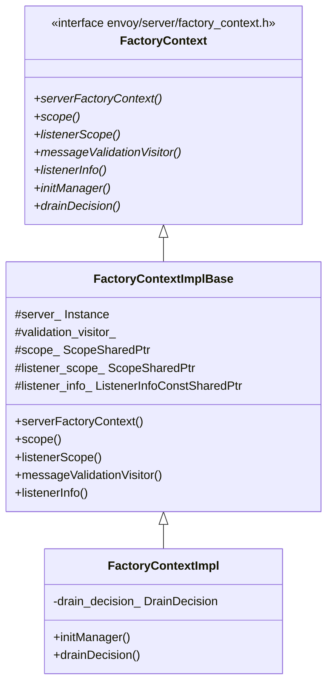

# Factory Context — `factory_context_impl.h`

**File:** `source/server/factory_context_impl.h`

Implements the `FactoryContext` interface passed to every network filter, listener filter,
and HTTP filter at creation time. Scopes stats to the correct listener prefix and wires
drain decisions and init managers to the per-listener lifecycle.

---

## Class Overview



---

## Two Scopes: `scope()` vs `listenerScope()`

Every filter factory receives two stats scopes:

| Method | Prefix | Purpose |
|---|---|---|
| `scope()` | Server root (`""`) | Global-scope stats (e.g., cluster stats shared across listeners) |
| `listenerScope()` | `listener.<name>.` | Listener-local stats (e.g., per-listener connection counts) |

Stats created via `scope()` are visible across all listeners; stats created via
`listenerScope()` are isolated to that listener instance. HCM (`ConnectionManagerImpl`)
uses `listenerScope()` for all its `downstream_cx_*` / `downstream_rq_*` counters.

---

## `FactoryContextImpl` — Full Context

```cpp
FactoryContextImpl(
    Server::Instance& server,
    Network::DrainDecision& drain_decision,
    Stats::ScopeSharedPtr scope,
    Stats::ScopeSharedPtr listener_scope,
    const Network::ListenerInfoConstSharedPtr& listener_info);
```

| Added method | Returns | Description |
|---|---|---|
| `initManager()` | `Init::Manager&` | Per-listener init manager; used by LDS-dependent targets (e.g., VHDS) |
| `drainDecision()` | `Network::DrainDecision&` | The listener's `DrainManagerImpl`; filters call `drainClose()` to decide `Connection: close` |

`drain_decision_` is the **listener-level** `DrainManager` (a child of the server-level
`DrainManager`). This means per-listener drain is independent — one listener can drain
while others continue serving.

---

## How Context Is Created

```mermaid
sequenceDiagram
    participant LM as ListenerManagerImpl
    participant L as ListenerImpl
    participant FC as FactoryContextImpl

    LM->>L: create listener from proto
    L->>L: create per-listener DrainManagerImpl (child of server drain manager)
    L->>L: create per-listener Init::Manager
    L->>L: create listener_scope = server.stats().createScope("listener.<name>.")
    L->>FC: FactoryContextImpl(server, drain_manager, scope, listener_scope, listener_info)
    L->>L: pass FC to each filter factory in filter_chain
    Note over FC: FC is owned by ListenerImpl; same instance reused for all filter chains
```

---

## `listenerInfo()`

Returns `Network::ListenerInfoConstSharedPtr` which exposes:
- Listener name and tag
- Whether the listener is `transparent` (TPROXY)
- Whether the listener is `bindToPort`
- Metadata attached to the listener

Used by filters that need listener-level metadata (e.g., to read custom metadata
fields set in the listener proto).

---

## `ServerFactoryContext` vs `FactoryContext`

| Interface | Used by | Lifetime |
|---|---|---|
| `ServerFactoryContext` (`ServerFactoryContextImpl`) | Cluster factories, global singletons, xDS | Server lifetime |
| `FactoryContext` (`FactoryContextImpl`) | Per-listener network/HTTP filter factories | Listener lifetime |

A `FactoryContextImpl` **contains** a reference to `ServerFactoryContext` via
`serverFactoryContext()` — filters that need server-wide services call through it,
while listener-scoped services (`drainDecision`, `listenerScope`, `initManager`) are
accessed directly.
