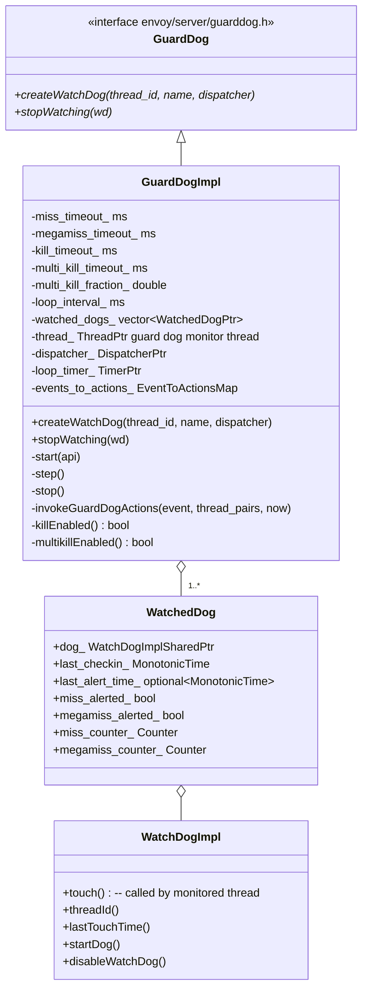
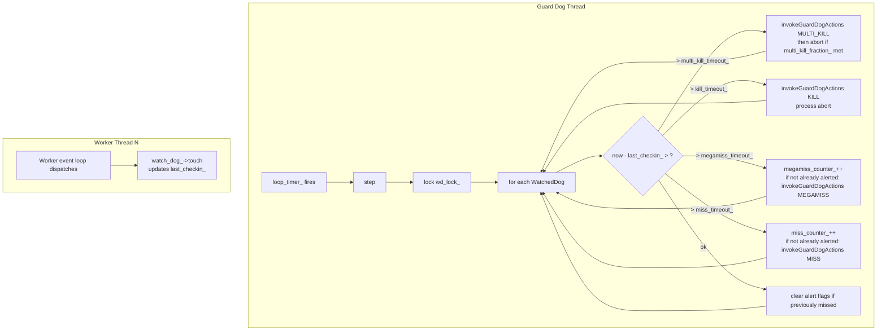
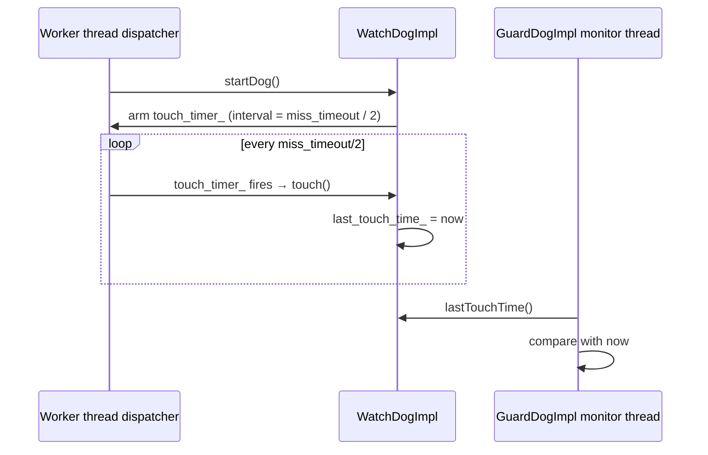

# Guard Dog (Watchdog) — `guarddog_impl.h`

**File:** `source/server/guarddog_impl.h`  
**Related:** `source/server/watchdog_impl.h`

`GuardDogImpl` runs a dedicated monitor thread that periodically checks all registered
watchdogs. If a thread fails to check in within the configured timeout, it fires miss /
megamiss counters and — if configured — aborts the process or invokes custom actions.
Two guard dogs exist in production: one for the main thread, one shared by all workers.

---

## Class Overview



---

## Monitor Thread Architecture

`GuardDogImpl` spawns its own OS thread on construction via `start(api)`. This thread
runs an `Event::Dispatcher` with a single repeating timer (`loop_timer_`). The timer
fires every `loop_interval_` (the minimum of `miss_timeout_` and `kill_timeout_`).



---

## Timeout Hierarchy

| Timeout | Config field | Effect when exceeded |
|---|---|---|
| `miss_timeout` | `watchdog.miss_timeout` | Increment `watchdog_miss` counter; fire `MISS` actions |
| `megamiss_timeout` | `watchdog.megamiss_timeout` | Increment `watchdog_megamiss` counter; fire `MEGAMISS` actions |
| `kill_timeout` | `watchdog.kill_timeout` | Fire `KILL` actions; then `abort()` if no action handles it |
| `multi_kill_timeout` | `watchdog.multikill_timeout` | Fire `MULTI_KILL` actions; abort if `≥ multi_kill_fraction_` of threads are hung |

`miss_timeout ≤ megamiss_timeout ≤ kill_timeout` is the expected ordering.
A value of 0 for `kill_timeout` / `multi_kill_timeout` disables those checks
(`killEnabled()` / `multikillEnabled()` return `false`).

`loop_interval_` = `min(miss_timeout_, kill_timeout_)` — scan frequently enough
to catch the tightest deadline.

---

## `WatchDogImpl` — Monitored Thread Side

Each monitored thread receives a `WatchDogSharedPtr` from `createWatchDog()`. The
thread must call `touch()` (via a dispatcher timer) frequently enough to stay under
`miss_timeout_`.



When `disableWatchDog()` is called (e.g., during orderly shutdown), the touch timer
is disarmed so the thread can stop without triggering false miss alerts.

---

## `WatchedDog` — Guard Dog Side State

Per-dog state held **inside** `GuardDogImpl` under `wd_lock_`:

| Field | Purpose |
|---|---|
| `dog_` | Shared pointer to the `WatchDogImpl` |
| `last_checkin_` | `lastTouchTime()` value captured during last `step()` |
| `last_alert_time_` | When the last miss/megamiss action was fired (rate-limits re-firing) |
| `miss_alerted_` | True if MISS action already fired for current miss episode |
| `megamiss_alerted_` | True if MEGAMISS action already fired for current episode |
| `miss_counter_` | Per-thread `watchdog_miss` counter |
| `megamiss_counter_` | Per-thread `watchdog_megamiss` counter |

Alert flags are cleared when a thread recovers (i.e., `last_checkin_` advances past
the timeout threshold) — preventing repeated firing for the same miss episode.

---

## `invokeGuardDogActions`

```cpp
void GuardDogImpl::invokeGuardDogActions(
    WatchDogAction::WatchdogEvent event,
    std::vector<std::pair<Thread::ThreadId, MonotonicTime>> thread_last_checkin_pairs,
    MonotonicTime now);
```

Looks up all registered `GuardDogAction` extensions for `event` in
`events_to_actions_` and calls each action's `run()` with the list of
`(thread_id, last_checkin_time)` pairs that triggered the event.

Custom guard dog actions are registered in the bootstrap proto under
`watchdog.actions[]`. Built-in action: `envoy.watchdog.abort_action` calls
`abort()` immediately.

---

## `createWatchDog` / `stopWatching`

```cpp
WatchDogSharedPtr GuardDogImpl::createWatchDog(
    Thread::ThreadId thread_id,
    const std::string& thread_name,
    Event::Dispatcher& dispatcher);
```

1. Creates a `WatchDogImpl` with `thread_id` and the worker's `dispatcher` (used to
   arm the touch timer on the correct thread).
2. Wraps it in a `WatchedDog` and appends to `watched_dogs_` under `wd_lock_`.
3. Returns the `WatchDogSharedPtr` to the caller (the worker thread).

```cpp
void GuardDogImpl::stopWatching(WatchDogSharedPtr wd);
```

Called when a worker is shutting down. Removes the corresponding `WatchedDog`
from `watched_dogs_` under `wd_lock_`. The `WatchDogImpl`'s `disableWatchDog()`
is called first to stop the touch timer before removal.

---

## `TestInterlockHook`

A virtual hook that allows unit tests to synchronize with the guard dog's `step()`
execution without real timing. Tests override `signalFromImpl()` (called after
each `step()` under the mutex) and `waitFromTest()` (blocks until `signalFromImpl()`
fires). Production uses the empty default implementation.

---

## Stats

| Stat | Per-thread prefix | Meaning |
|---|---|---|
| `watchdog_miss` | `server.<thread_name>.` | Thread missed its check-in by `> miss_timeout` |
| `watchdog_megamiss` | `server.<thread_name>.` | Thread missed by `> megamiss_timeout` |

Server-wide counters `server.watchdog_miss` and `server.watchdog_megamiss` are
also incremented (one guard dog instance per process level, covering main + workers).
