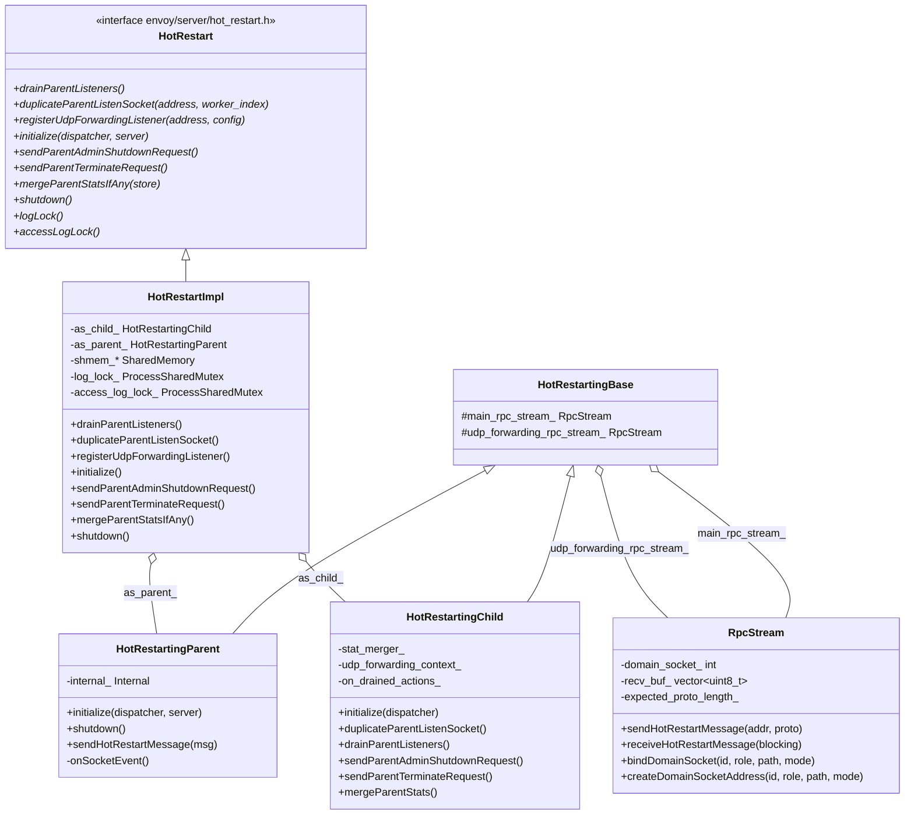
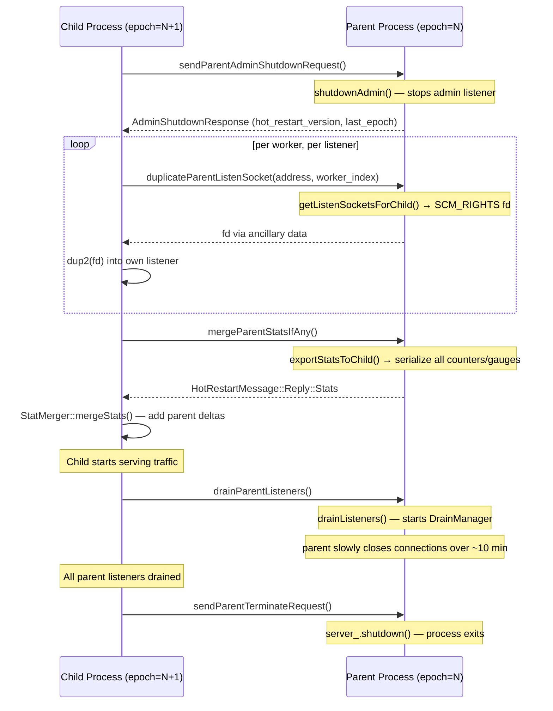

# Hot Restart — `hot_restart_impl.h` / `hot_restarting_*.h`

**Files:**
- `source/server/hot_restart_impl.h` — top-level `HotRestartImpl`, shared memory, `ProcessSharedMutex`
- `source/server/hot_restarting_base.h` — `RpcStream` (Unix socket IPC protocol), `HotRestartingBase`
- `source/server/hot_restarting_parent.h` — parent-side logic (`HotRestartingParent`)
- `source/server/hot_restarting_child.h` — child-side logic (`HotRestartingChild`)

Hot restart allows Envoy to upgrade its binary or config with **zero dropped connections**.
The old ("parent") process hands open listening sockets to the new ("child") process via
`SCM_RIGHTS` file descriptor passing, drains its connections, then exits — all while both
processes serve traffic simultaneously for up to ~15 minutes.

---

## Process Topology

```mermaid
flowchart TD
    subgraph Parent Process epoch=N
        P[HotRestartImpl\nas_parent_ = HotRestartingParent]
        PS[SharedMemory: log_lock_, access_log_lock_, flags_]
    end

    subgraph Child Process epoch=N+1
        C[HotRestartImpl\nas_child_ = HotRestartingChild]
    end

    P <-->|Unix socket IPC\nhot_restart.pb HotRestartMessage| C
    P --- PS
    C --- PS
    PS["/dev/shm/envoy_shared_memory_<base_id>"]
```

- Each process computes its domain socket name from `base_id` and `restart_epoch`.
- `base_id` cycles through `[0, MaxConcurrentProcesses)` — typically 0, 1, 2, 0, 1, …
- `HOT_RESTART_VERSION = 11` — must match between parent and child. Mismatch forces a
  cold restart instead.

---

## Class Hierarchy



---

## Shared Memory Segment (`SharedMemory`)

```cpp
struct SharedMemory {
    uint64_t size_;           // Sanity check on segment size
    uint64_t version_;        // HOT_RESTART_VERSION — must match
    pthread_mutex_t log_lock_;         // Cross-process log write serialization
    pthread_mutex_t access_log_lock_;  // Cross-process access log serialization
    std::atomic<uint64_t> flags_;      // SHMEM_FLAGS_INITIALIZING = 0x1
};
```

Created via `shm_open` + `mmap` with the path `/dev/shm/envoy_shared_memory_<base_id>`.
The child process attaches to the same segment by name. If `flags_ & SHMEM_FLAGS_INITIALIZING`
is set when the child attaches, it means the parent has not fully initialized yet.

`ProcessSharedMutex` wraps `pthread_mutex_t` with `PTHREAD_PROCESS_SHARED` semantics and
handles `EOWNERDEAD` (parent died with lock held) via `pthread_mutex_consistent()`.

---

## RPC Protocol (`RpcStream`)

```
Wire format (over SOCK_DGRAM unix socket):
┌──────────────┬────────────────────────────────────────────┐
│ 8 bytes      │ N bytes                                    │
│ uint64 (BE)  │ serialized HotRestartMessage protobuf      │
│ = length N   │ (may span multiple datagrams if N > 4088)  │
└──────────────┴────────────────────────────────────────────┘
```

Key properties:
- **Child initiates all exchanges** and blocks until a reply arrives (implicit pairing)
- Max datagram = 4096 bytes; large protos are fragmented across datagrams
- `receiveHotRestartMessage(Blocking::No)` returns `nullptr` if no full message available
- File descriptors (listen sockets) are passed via `SCM_RIGHTS` in `msghdr` ancillary data

Two independent streams:
- `main_rpc_stream_` — admin shutdown, socket duplication, stat export, drain commands
- `udp_forwarding_rpc_stream_` — QUIC/UDP packet forwarding from parent to child (separate
  to avoid interleaving with main stream replies)

---

## Hot Restart Sequence



---

## `HotRestartingParent::Internal`

Handles the server-side logic for each request type:

| Method | Triggered by | Action |
|---|---|---|
| `shutdownAdmin()` | Child's admin shutdown request | Calls `server_.shutdownAdmin()`, returns version |
| `getListenSocketsForChild(request)` | Child's socket dup request | Calls `server_.getListenerManager().getSocketForWorker(address, index)`, passes fd via `SCM_RIGHTS` |
| `exportStatsToChild(stats_proto)` | Child's stats merge request | Iterates all counters/gauges, serializes deltas and gauge values into `HotRestartMessage::Reply::Stats` |
| `drainListeners()` | Child's drain request | Calls `server_.drainListeners()` |
| `handle(worker_index, packet)` | UDP forwarding from child | Forwards QUIC packets to correct worker |

---

## `HotRestartingChild` — Parent-Drained Callbacks

`HotRestartingChild` implements `Network::ParentDrainedCallbackRegistrar`:

```cpp
void registerParentDrainedCallback(
    const Network::Address::InstanceConstSharedPtr& addr,
    absl::AnyInvocable<void()> action);
```

Called by `ActiveQuicListener` to be notified when the parent has finished draining
for a given address. The child starts fully serving on that address only after this
fires, preventing a gap in UDP/QUIC packet handling.

`on_drained_actions_` is an `unordered_multimap<string, AnyInvocable>` because multiple
listener instances per address are possible (one per worker). All are invoked when
`allDrainsImplicitlyComplete()` fires (either on explicit parent terminate, or when
parent is already dead).

---

## `UdpForwardingContext`

During the hot restart overlap period, new QUIC connections arrive at the **parent**'s
socket (which the child has not yet taken over). The parent forwards these UDP packets
to the child via `udp_forwarding_rpc_stream_`.

`UdpForwardingContext` maintains a `flat_hash_map<string, ForwardEntry>` mapping
listener addresses to `UdpListenerConfig` objects, used by the child to route
forwarded packets to the correct listener.

---

## Stat Merging (`StatMerger`)

Parent exports stats as a proto of `(name → value)` pairs. `StatMerger` on the child:

- **Counters**: adds parent's counter value to child's counter (avoids double-counting
  by tracking the "parent baseline" — a counter that increments in the parent before
  restart should not appear as a new increment in the child)
- **Gauges**: takes parent's gauge value verbatim (absolute, not delta) for gauges
  with `Accumulate` import mode; ignores `NeverImport` gauges

`hot_restart_generation` gauge is incremented by 1 each restart to distinguish epochs.

---

## `HotRestartImpl` Constructor Parameters

| Parameter | Purpose |
|---|---|
| `base_id` | Identifies the shared memory segment and socket namespace (`[0, MaxConcurrentProcesses)`) |
| `restart_epoch` | Monotonically increasing restart counter; used to compute socket path |
| `socket_path` | Base path for domain sockets (default `/var/run/envoy`) |
| `socket_mode` | File mode for socket (default `0600`) |
| `skip_hot_restart_on_no_parent` | If `true`, skip hot restart protocol if parent is not found |
| `skip_parent_stats` | If `true`, skip merging parent's stats (useful in tests) |
