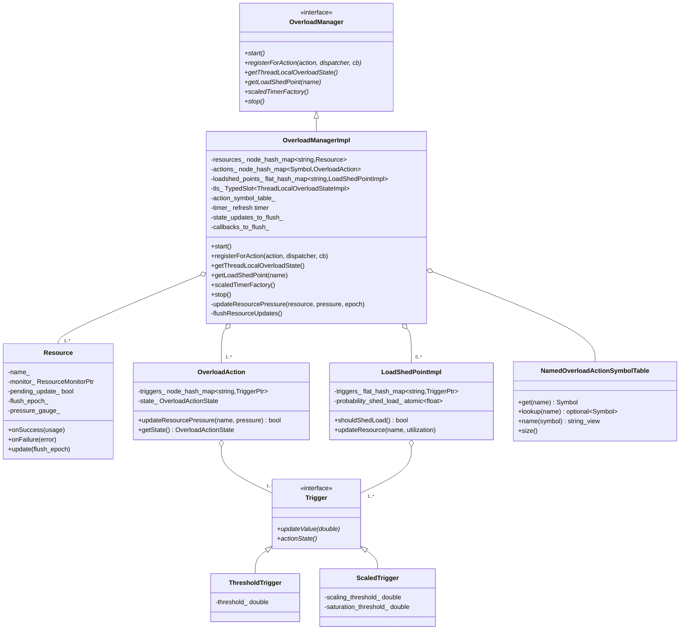
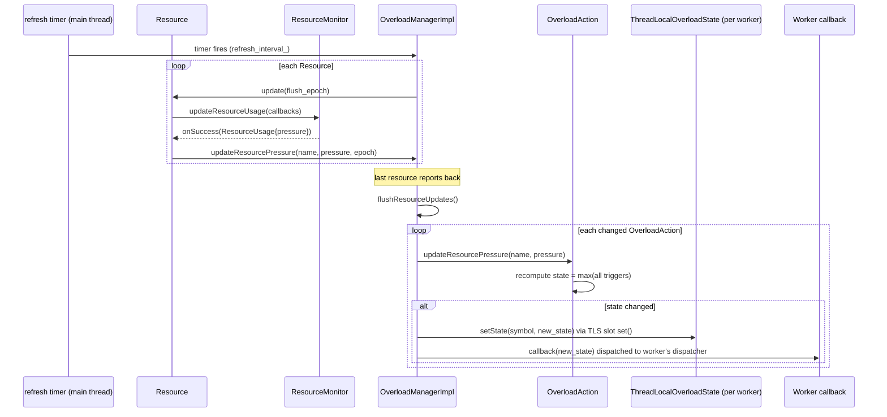
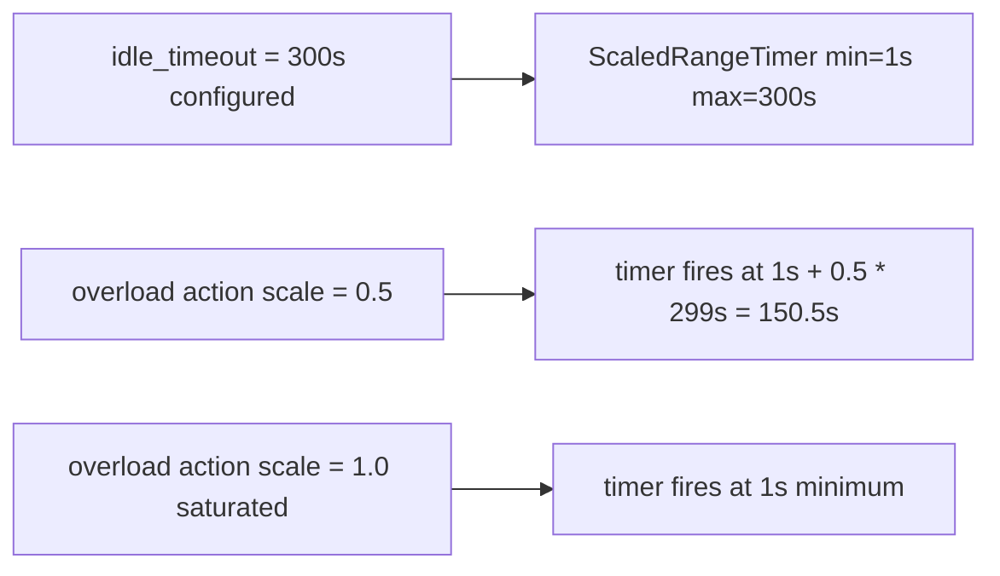

# Overload Manager — `overload_manager_impl.h`

**File:** `source/server/overload_manager_impl.h`

`OverloadManagerImpl` monitors system resources (memory, file descriptors, CPU, heap
size) on a timer and translates raw utilization values into `OverloadActionState` values
that are dispatched to all worker threads. Workers react by throttling, shedding, or
terminating connections and streams.

---

## Class Overview



---

## Data Flow: Resource → Action → Worker Thread



### Flush Epoch

`flush_epoch_` is incremented on each refresh cycle. Each `Resource` stores
`flush_epoch_` when it calls `update()`. When `onSuccess` fires, the resource
compares its epoch with the current epoch — if the epoch has advanced (i.e., a
later cycle started before this resource's async callback returned), the update
is skipped (`skipped_updates_counter_` incremented). This prevents stale
resource readings from overwriting fresher ones.

---

## `Trigger` — Resource → Action Mapping

Two trigger types translate a raw `double` pressure value (0.0–1.0+) into an
`OverloadActionState`:

### `ThresholdTrigger`

```
if pressure >= threshold → SATURATED (1.0)
else                     → NEUTRAL   (0.0)
```

Binary flip at the configured threshold.

### `ScaledTrigger`

```
if pressure <  scaling_threshold  → NEUTRAL (0.0)
if pressure >= saturation_threshold → SATURATED (1.0)
else → linear scale between the two thresholds
     → OverloadActionState(scale_percent)
```

`OverloadActionState::value()` returns a float in `[0.0, 1.0]` where 0 = neutral
and 1 = fully saturated. Used by `ScaledRangeTimer` to linearly compress timer
ranges under load.

---

## `OverloadAction`

Each `OverloadAction` has a set of `Trigger`s, one per configured resource. Its
`state_` is the **maximum** `OverloadActionState` across all triggers. When any
trigger changes, `getState()` returns the new max and the action notifies all
registered callbacks.

```cpp
bool OverloadAction::updateResourcePressure(const std::string& name, double pressure) {
    auto& trigger = triggers_[name];
    bool changed = trigger->updateValue(pressure);
    if (changed) {
        state_ = std::max over all triggers of trigger->actionState();
    }
    return changed;
}
```

---

## `LoadShedPointImpl`

`LoadShedPoint` is a probabilistic shedding mechanism checked at specific points
in the request/connection lifecycle (e.g., before accepting a new connection, before
allocating a new stream).

```cpp
bool LoadShedPointImpl::shouldShedLoad() {
    return random_generator_.bernoulli(probability_shed_load_.load());
}
```

`probability_shed_load_` is an `atomic<float>` updated on the main thread and read
lock-free from any worker thread. The probability is the max of all trigger scale
values — e.g., a `ScaledTrigger` at 60% resource pressure yields 60% probability
of shedding.

Built-in load shed points (from `OverloadActionNames`):
- `envoy.load_shed_points.tcp_listener_accept` — shed before accepting new TCP connections
- `envoy.load_shed_points.http_connection_manager_decode_headers` — shed before decoding headers
- `envoy.load_shed_points.http1_server_abort_dispatch` — shed during H1 dispatch
- `envoy.load_shed_points.http2_server_go_away_on_dispatch` — send GOAWAY under load

---

## `NamedOverloadActionSymbolTable`

Maps action names (strings) to compact integer `Symbol` indices for O(1) dispatch
to the correct TLS slot entry without string comparisons on the hot path.

```cpp
Symbol s = table_.get("envoy.overload_actions.stop_accepting_requests");
// s.index() == 3  (stable across the process lifetime)
```

Symbols are guaranteed contiguous from 0, which allows `ThreadLocalOverloadStateImpl`
to use a `std::vector` indexed by symbol for direct O(1) state lookup.

---

## `ThreadLocalOverloadStateImpl`

Stored per worker thread via `tls_`. Main thread flushes via `tls_.set(...)` to
propagate updated `OverloadActionState` values atomically.

Workers call:
```cpp
OverloadActionState state = tls_->getState(action_symbol);
```
This is a `std::vector` index — no lock, no hash lookup.

---

## Built-in Overload Actions

Configured in the bootstrap `overload_manager` proto field. Common production actions:

| Action name | Typical trigger | Effect |
|---|---|---|
| `envoy.overload_actions.stop_accepting_requests` | heap size ≥ 95% | Worker calls `stopAcceptingConnectionsCb` |
| `envoy.overload_actions.stop_accepting_connections` | heap size ≥ 95% | Listener disables accept |
| `envoy.overload_actions.disable_http_keepalive` | heap size ≥ 85% | HCM adds `Connection: close` |
| `envoy.overload_actions.reset_high_memory_stream` | heap size ≥ 90% | Worker resets streams by memory usage |
| `envoy.overload_actions.reject_incoming_connections` | fd count ≥ 80% | TCP listener rejects accept |

---

## `scaledTimerFactory()`

Returns a factory that creates `ScaledRangeTimerManager` instances. Each worker
gets its own manager. Under the `ScaledMinimumTimer` action, timers fire sooner
than their configured maximum to shed idle connections more aggressively.


