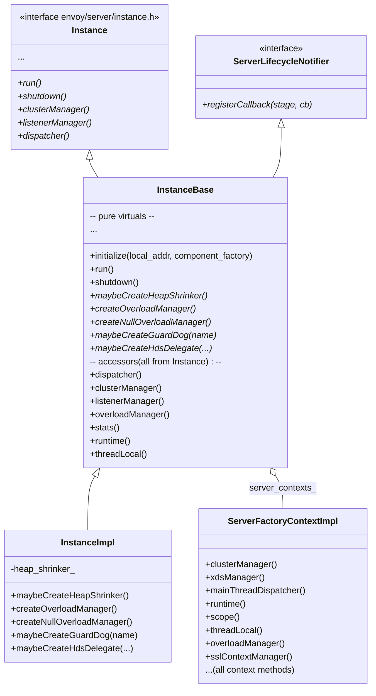
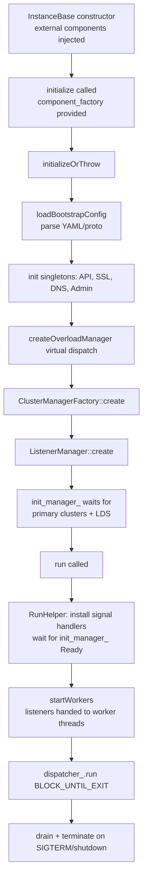

# Server Instance — `server.h`

**File:** `source/server/server.h`

Defines the core server bootstrap classes: `InstanceBase` (the server skeleton),
`InstanceImpl` (production subclass), `ServerFactoryContextImpl` (the DI context
passed to every extension), `RunHelper` (signal/init watcher wired inside `run()`),
`InstanceUtil` (static helpers), and `MetricSnapshotImpl` (flush-time metric capture).

---

## Class Hierarchy



---

## `InstanceBase` — Server Bootstrap

`InstanceBase` is the central coordinator. The constructor receives all pre-built
infrastructure (TLS, store, thread factory, file system) injected from `main()`.
Initialization is two-phase:



### `initializeOrThrow` Key Steps

1. Parse and validate bootstrap proto; apply overrides from CLI flags.
2. Create `Api::ApiImpl`, `AccessLogManager`, `SslContextManager`, `SecretManager`.
3. Wire `main_thread_guard_dog_` and `worker_guard_dog_` via `maybeCreateGuardDog`.
4. Create `OverloadManager` (via `createOverloadManager()`) and `NullOverloadManager`.
5. Build `ClusterManagerImpl` from bootstrap `static_resources.clusters` and CDS.
6. Create `ListenerManager` — instantiates listeners from bootstrap + LDS.
7. Register stats flush timer (`stat_flush_timer_`).
8. Create `RunHelper` (on the stack in `run()`) which arms signal handlers and
   watches `InitManager` for readiness.

### `run()`

Blocks the main thread in `dispatcher_->run(Event::Dispatcher::RunType::Block)`.
Returns only after `shutdown_` is set (from SIGTERM / SIGINT / admin `/quitquitquit`).

### `startWorkers()`

Called by `RunHelper` after `InitManager` fires `Ready`:
```cpp
void InstanceBase::startWorkers() {
    listener_manager_->startWorkers(*worker_guard_dog_, [this]() {
        main_dispatch_loop_started_.store(true);
        // Switch validation to dynamic mode
    });
    workers_started_ = true;
}
```

After this point, `messageValidationVisitor()` returns the **dynamic** visitor
(permissive unknown fields) instead of the static (strict) visitor.

---

## Member Ownership and Destruction Order

Declaration order in `InstanceBase` matters — destruction is reverse-declaration.
Critical ordering enforced by comments in the code:

| Member | Must outlive |
|---|---|
| `init_manager_` (reference) | All members that call `init_manager_.add()` in their ctor |
| `secret_manager_` | `listener_manager_`, `config_` (ClusterManager), `dispatcher_` |
| `ssl_context_manager_` | `dispatcher_` (ClusterInfo holds SslSocketFactory, deleted on main thread) |
| `local_info_` | Most other members that log or report identity |

---

## Server Stats (`ALL_SERVER_STATS`)

All stats are under the `server.` prefix.

**Counters:**

| Stat | Meaning |
|---|---|
| `debug_assertion_failures` | `ASSERT()` fired in debug mode |
| `envoy_bug_failures` | `IS_ENVOY_BUG()` fired |
| `envoy_notifications` | Non-fatal Envoy notifications |
| `dynamic_unknown_fields` | Unknown proto fields in dynamic config |
| `static_unknown_fields` | Unknown proto fields in static config |
| `wip_protos` | WIP (work-in-progress) proto usage |
| `dropped_stat_flushes` | Stat flush skipped because previous flush still running |

**Gauges:**

| Stat | Meaning |
|---|---|
| `concurrency` | Number of worker threads |
| `live` | 1 = server is live (health checks pass) |
| `state` | `ServerState` enum value (Initializing/Live/PreDraining/Draining) |
| `uptime` | Seconds since start |
| `version` | Envoy build version number |
| `hot_restart_epoch` | Epoch number (0 = original, 1+ = hot-restarted child) |
| `memory_allocated` | jemalloc `allocated` bytes |
| `memory_heap_size` | jemalloc `heap_size` bytes |
| `memory_physical_size` | RSS physical memory |
| `total_connections` | Current total connections across all workers |
| `parent_connections` | Connections from the parent process (hot restart) |
| `days_until_first_cert_expiring` | Min days to cert expiry across all certs |
| `seconds_until_first_ocsp_response_expiring` | Min seconds to OCSP expiry |
| `stats_recent_lookups` | Number of recent stats symbol table lookups |

**Histograms:**

| Stat | Meaning |
|---|---|
| `initialization_time_ms` | Time from process start to workers ready (ms) |

---

## `ServerFactoryContextImpl`

A thin adapter that implements **both** `ServerFactoryContext` and
`TransportSocketFactoryContext` by delegating every call to the held `Instance&`.
This single object is stored as `InstanceBase::server_contexts_` and passed to every
extension factory, cluster, filter, transport socket etc.

Extensions access services through this context rather than holding a raw pointer to
the server instance, allowing test doubles to be injected.

---

## `RunHelper`

Created on the stack inside `InstanceBase::run()`. Its constructor:

1. Registers `Init::WatcherImpl` on `init_manager_` — fires `workers_start_cb` when
   all init targets complete.
2. Installs signal handlers:
   - `SIGTERM` → `instance.shutdown()`
   - `SIGINT` → `instance.shutdown()`
   - `SIGUSR1` → `instance.hotRestart().logLiveStats()` (log current stats)
   - `SIGHUP` → `logRotate()` (reopen log files)

---

## `InstanceUtil` — Static Helpers

| Method | Purpose |
|---|---|
| `loadBootstrapConfig(bootstrap, options, visitor, api)` | Load + merge YAML/proto bootstrap config; handles `--config-path`, `--config-yaml`, and admin override |
| `flushMetricsToSinks(sinks, store, cm, time_source)` | Latch counters, collect gauges/histograms, call `sink.flush(snapshot)` on each sink |
| `createRuntime(server, config)` | Default runtime loader creation used by production and most tests |
| `raiseFileLimits()` | Calls `setrlimit(RLIMIT_NOFILE, ...)` to raise soft fd limit to hard limit |

---

## `MetricSnapshotImpl`

Point-in-time snapshot of all stats taken during periodic `flushStats()`. Holds
shared_ptrs to stats to prevent deallocation during the flush. Two separate vectors
are maintained:

- `snapped_counters_` / `counters_` — `CounterSnapshot` pairs (name + delta since last flush)
- `snapped_gauges_` / `gauges_` — reference wrappers to live gauges
- `snapped_histograms_` / `histograms_` — reference wrappers to parent histograms
- `host_counters_` / `host_gauges_` — per-host primitive stats from ClusterManager

`snapshot_time_` is captured at construction time as `SystemTime`.

---

## `ComponentFactory`

Minimal factory interface called during `initialize()`:

```cpp
class ComponentFactory {
    virtual DrainManagerPtr createDrainManager(Instance& server) PURE;
    virtual Runtime::LoaderPtr createRuntime(Instance& server, Configuration::Initial& config) PURE;
};
```

Production implementation (`ProdComponentFactory` in `main.cc`) creates
`DrainManagerImpl` and delegates runtime creation to `InstanceUtil::createRuntime`.
Test implementations inject mock drain managers and/or fake runtime.

---

## Lifecycle Notifier

`InstanceBase` implements `ServerLifecycleNotifier` itself. Callbacks are stored
in `stage_callbacks_` and `stage_completable_callbacks_` keyed by `Stage`:

```
Stage: ShutdownExit
Stage: WorkerThreadsInitialized  (fired just before workers start serving)
Stage: ...
```

Callbacks registered via `registerCallback(stage, cb)`. Completion callbacks receive
a `std::function<void()>` to call when async work is done — `InstanceBase` waits for
all completions before advancing to the next stage.
