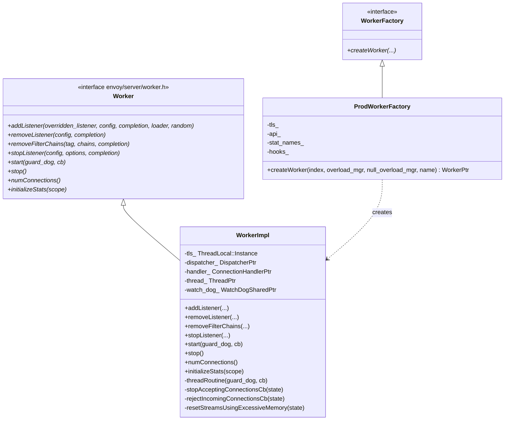
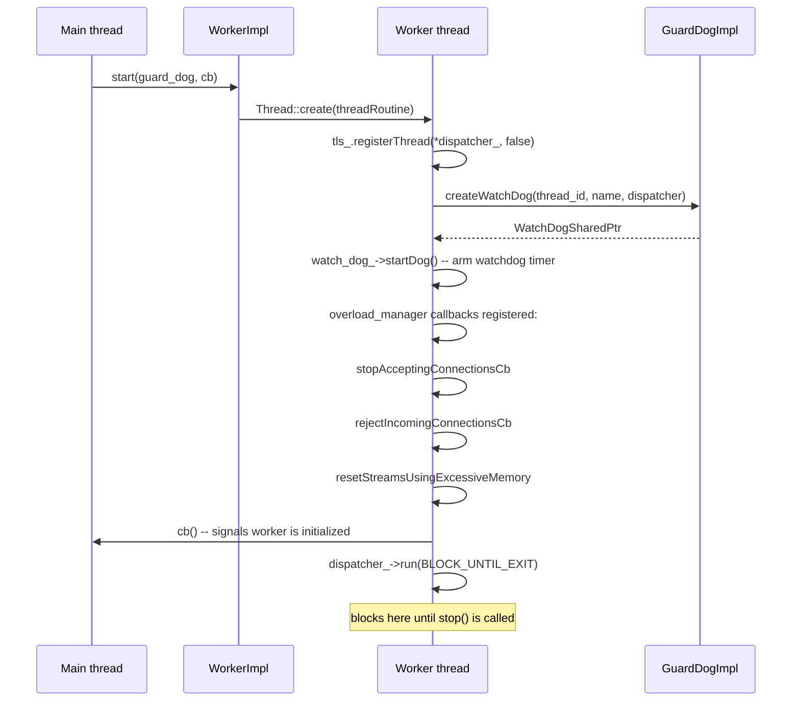
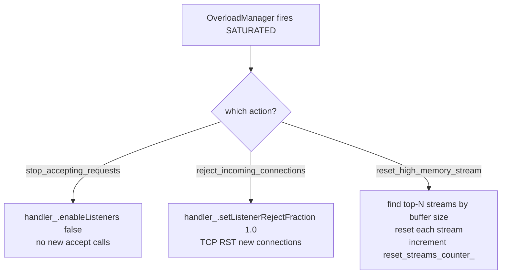

# Worker Implementation — `worker_impl.h`

**File:** `source/server/worker_impl.h`

`WorkerImpl` is one I/O worker thread. Envoy runs `--concurrency N` of them (default:
hardware threads). Each worker owns an independent `Event::Dispatcher` (libevent loop),
a `Network::ConnectionHandler` (accepts connections on listened sockets), and a
`WatchDog` handle that checks in with `GuardDogImpl` to prove liveness.

---

## Class Overview



---

## Worker Lifecycle

```mermaid
stateDiagram-v2
    [*] --> Created : ProdWorkerFactory::createWorker()
    Created --> Running : start(guard_dog, cb)
    Running --> Running : addListener / removeListener\n(cross-thread dispatch)
    Running --> Draining : stopListener()\nstop accepting new connections
    Draining --> Stopped : stop()\ndispatcher exits event loop
    Stopped --> [*] : thread joins
```

### `start(guard_dog, cb)`



### `addListener()` / `removeListener()`

All listener operations are **cross-thread dispatched** to the worker's
`dispatcher_`. This means calls from the main thread (via `ListenerManager`) are
not synchronous — they post a closure to the worker's event loop.

```cpp
void WorkerImpl::addListener(
    absl::optional<uint64_t> overridden_listener,
    Network::ListenerConfig& listener,
    AddListenerCompletion completion, ...) {

    dispatcher_->post([this, overridden_listener, &listener, completion, ...]() {
        handler_->addListener(overridden_listener, listener, loader, random);
        hooks_.onWorkerListenerAdded();
        completion();
    });
}
```

`completion` is called only **after** the listener is installed in the worker's
`ConnectionHandler`. `ListenerManagerImpl` uses this to track when all workers
have picked up a new listener before ACK-ing the LDS response.

### `stop()`

Posts `dispatcher_->exit()` to the worker's own event loop. The thread returns
from `dispatcher_->run(Block)` and joins.

---

## Overload Manager Callbacks

Three callbacks are registered by the worker against the `OverloadManager` during
`threadRoutine()`:

| Callback | Overload action | Effect |
|---|---|---|
| `stopAcceptingConnectionsCb` | `envoy.overload_actions.stop_accepting_requests` | Calls `handler_->enableListeners(false)` — stops new `accept()` calls |
| `rejectIncomingConnectionsCb` | `envoy.overload_actions.reject_incoming_connections` | Calls `handler_->setListenerRejectFraction(state.value())` — probabilistic rejection at the TCP layer |
| `resetStreamsUsingExcessiveMemory` | `envoy.overload_actions.reset_high_memory_stream` | Iterates active streams sorted by buffer usage, resets the most memory-hungry ones up to a cap |



---

## `ConnectionHandler` Ownership

Each `WorkerImpl` owns a `Network::ConnectionHandlerPtr`. The handler:
- Holds all `ActiveListener` instances for this worker
- Accepts connections and dispatches them to filters
- Tracks `numConnections()` across all listeners

`numConnections()` on `WorkerImpl` delegates directly to `handler_->numConnections()`.

---

## `ProdWorkerFactory`

Simple factory that wires the worker to the server-wide `ThreadLocal::Instance`,
`Api::Api`, and `ListenerHooks`.

```cpp
WorkerPtr ProdWorkerFactory::createWorker(
    uint32_t index,
    OverloadManager& overload_manager,
    OverloadManager& null_overload_manager,
    const std::string& worker_name) {

    Event::DispatcherPtr dispatcher = api_.allocateDispatcher(worker_name);
    return std::make_unique<WorkerImpl>(
        tls_, hooks_, std::move(dispatcher),
        std::make_unique<Network::ConnectionHandlerImpl>(*dispatcher, index),
        overload_manager, api_, stat_names_);
}
```

Each worker gets its own `Dispatcher` and `ConnectionHandlerImpl` — there is no
shared state between workers on the data path.

---

## Thread-Local Storage (TLS)

`WorkerImpl` registers its `dispatcher_` with the `ThreadLocal::Instance` via
`tls_.registerThread(*dispatcher_, false)` at thread startup. This enables
all TLS slots (stats, cluster manager, overload state, etc.) to be available
on the worker thread without locks.

`false` = this is **not** the main thread. The main thread registers with `true`.

---

## `WorkerStatNames`

```cpp
struct WorkerStatNames {
    Stats::StatNamePool pool_;
    Stats::StatName reset_high_memory_stream_;  // "reset_streams_count"
};
```

Pre-interned stat name used by `resetStreamsUsingExcessiveMemory` to increment
`worker.<name>.reset_streams_count` without a symbol table lookup on the hot path.
